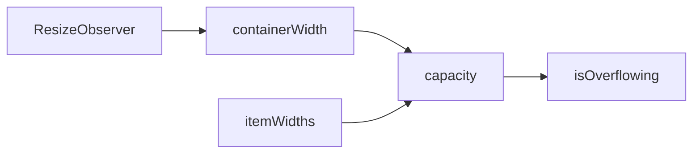

# useOverflow

A composable for computing how many items fit in a container based on available width, enabling responsive truncation for pagination, breadcrumbs, and similar components.

<DocsPageFeatures :frontmatter />

## Usage

The `useOverflow` composable provides reactive container width tracking and capacity calculation. It supports two modes: variable-width (for items with different widths like breadcrumbs) and uniform-width (for same-width items like pagination buttons).

```ts
import { useTemplateRef } from 'vue'
import { createOverflow } from '@vuetify/v0'

const containerRef = useTemplateRef('container')

// Pass container as a ref or getter for proper reactive tracking
const overflow = createOverflow({
  container: containerRef,
  gap: 8,
  reserved: 40,
})

// Check capacity
console.log(overflow.capacity.value) // Number of items that fit
console.log(overflow.isOverflowing.value) // true if items exceed container
```

## Architecture

`useOverflow` uses ResizeObserver to compute container capacity:



<DocsApi />

## Examples

### Variable-Width Mode (Breadcrumbs)

For items with different widths, measure each item individually:

```vue UseOverflow
<script setup lang="ts">
  import { useTemplateRef } from 'vue'
  import { createOverflow } from '@vuetify/v0'

  const items = ['Home', 'Documentation', 'Components', 'Breadcrumbs']
  const containerRef = useTemplateRef('nav')

  const overflow = createOverflow({
    container: containerRef,
    gap: 8,
    reserved: 40, // Space for ellipsis
    reverse: true, // Calculate from trailing items
  })
</script>

<template>
  <nav ref="nav">
    <template v-for="(item, i) in items" :key="i">
      <span
        v-if="!overflow.isOverflowing.value || i >= items.length - overflow.capacity.value"
        :ref="el => overflow.measure(i, el)"
      >
        {{ item }}
      </span>
    </template>
    <span v-if="overflow.isOverflowing.value">...</span>
  </nav>
</template>
```

### Uniform-Width Mode (Pagination)

For items with the same width, provide `itemWidth` for efficient calculation:

```ts
import { shallowRef } from 'vue'
import { createOverflow } from '@vuetify/v0'

const containerRef = useTemplateRef('container')
const buttonWidth = shallowRef(36) // Measured from sample button

const overflow = createOverflow({
  container: containerRef,
  itemWidth: buttonWidth,
  reserved: () => buttonWidth.value * 4, // Space for nav buttons
})

// Capacity is calculated as: (availableWidth / itemWidth)
console.log(overflow.capacity.value)
```

### Measuring Items

In variable-width mode, use `measure()` to register item elements:

```ts
import { createOverflow } from '@vuetify/v0'

const overflow = createOverflow({ gap: 4 })

// Register an element at index 0
const element = document.querySelector('.item')
overflow.measure(0, element)

// Remove measurement (e.g., when element unmounts)
overflow.measure(0, undefined)

// Clear all measurements
overflow.reset()
```

### Reactive Reserved Space

Reserved space can be reactive:

```ts
import { shallowRef } from 'vue'
import { createOverflow } from '@vuetify/v0'

const navButtonCount = shallowRef(4)
const buttonWidth = 36

const overflow = createOverflow({
  itemWidth: buttonWidth,
  reserved: () => buttonWidth * navButtonCount.value,
})

// Capacity updates when navButtonCount changes
navButtonCount.value = 2
console.log(overflow.capacity.value) // More capacity available
```

### Dependency Injection

Use the context pattern for component hierarchies:

```ts
// Parent component
import { createOverflowContext } from '@vuetify/v0'

const [useOverflow, provideOverflowContext, overflow] = createOverflowContext({
  namespace: 'my-overflow',
  gap: 8,
  reserved: 100,
})

provideOverflowContext()

// Child component
import { useOverflow } from '@vuetify/v0'

const overflow = useOverflow('my-overflow')
overflow.measure(0, myElement)
```

### Reverse Mode for Trailing Items

When `reverse: true`, capacity is calculated from the end, useful for breadcrumbs:

```ts
import { createOverflow } from '@vuetify/v0'

const items = ['A', 'B', 'C', 'D', 'E'] // Variable width items
const overflow = createOverflow({
  reverse: true,
  reserved: 50, // Space for first item + ellipsis
})

// If capacity is 2, show items at indices 3 and 4 (D and E)
const startIndex = items.length - overflow.capacity.value
const visibleItems = items.slice(startIndex)
```

### Vue Component Example

```vue UseOverflow
<script setup lang="ts">
  import { ref, useTemplateRef } from 'vue'
  import { createOverflow } from '@vuetify/v0'

  const items = ref(['First', 'Second', 'Third', 'Fourth', 'Fifth'])
  const containerRef = useTemplateRef('container')

  const overflow = createOverflow({
    container: containerRef,
    gap: 8,
    reserved: 24, // Ellipsis space
  })
</script>

<template>
  <div
    ref="container"
    class="flex gap-2 overflow-hidden"
  >
    <template v-for="(item, i) in items" :key="i">
      <span
        v-if="i < overflow.capacity.value"
        :ref="el => overflow.measure(i, el)"
        class="whitespace-nowrap"
      >
        {{ item }}
      </span>
    </template>
    <span v-if="overflow.isOverflowing.value">...</span>
  </div>

  <p>
    Showing {{ Math.min(overflow.capacity.value, items.length) }} of {{ items.length }} items
  </p>
</template>
```

## Notes

- Container width is tracked via `ResizeObserver` for automatic updates
- In SSR or before measurement, `capacity` returns `Infinity` (show all items)
- Variable-width mode measures each item's `offsetWidth` plus horizontal margins
- Uniform-width mode is more efficient as it doesn't require individual measurements
- The `total` computed includes gaps between measured items
- Use `reverse: true` for breadcrumb-style components where trailing items take priority

