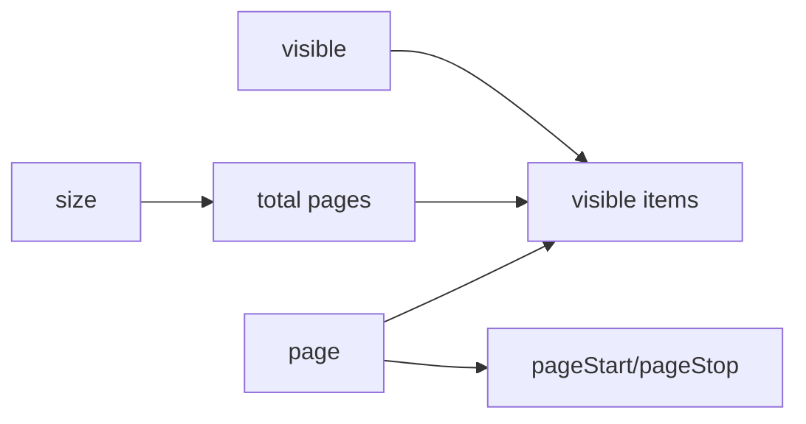

# usePagination

A lightweight composable for managing pagination state with navigation methods and computed visible page items.

<DocsPageFeatures :frontmatter />

## Usage

The `usePagination` composable provides reactive pagination state management with navigation methods and automatic computation of visible page items with ellipsis support.

```ts
import { ref } from 'vue'
import { createPagination } from '@vuetify/v0'

const pagination = createPagination({
  size: 200, // Total items
  itemsPerPage: 10,
  visible: 5,
})

console.log(pagination.pages) // 20 (200 items / 10 per page)
console.log(pagination.items.value)
// [
//   { type: 'page', value: 1 },
//   { type: 'page', value: 2 },
//   { type: 'page', value: 3 },
//   { type: 'ellipsis', value: '…' },
//   { type: 'page', value: 20 }
// ]
```

## Architecture

`usePagination` computes page state and navigation:



<DocsApi />

## Examples

### Basic Navigation

```ts
import { createPagination } from '@vuetify/v0'

const pagination = createPagination({
  size: 100,
  itemsPerPage: 10,
})

console.log(pagination.page.value) // 1
console.log(pagination.pages) // 10

pagination.next()
console.log(pagination.page.value) // 2

pagination.select(5)
console.log(pagination.page.value) // 5

pagination.last()
console.log(pagination.page.value) // 10
```

### v-model Support

Pass a ref to sync the page value:

```ts
import { shallowRef } from 'vue'
import { createPagination } from '@vuetify/v0'

const page = shallowRef(1)
const pagination = createPagination({
  page,
  size: 100,
})

// Changes to either sync automatically
pagination.next()
console.log(page.value) // 2

page.value = 5
console.log(pagination.page.value) // 5
```

### Computing Page Range

Use `pageStart` and `pageStop` to slice your data:

```ts
import { computed, ref } from 'vue'
import { createPagination } from '@vuetify/v0'

const allItems = ref([...Array(100).keys()].map(i => ({ id: i + 1 })))
const pagination = createPagination({
  size: () => allItems.value.length,
  itemsPerPage: 10,
})

const visibleItems = computed(() =>
  allItems.value.slice(pagination.pageStart.value, pagination.pageStop.value)
)

// Page 1: items 0-9 (ids 1-10)
console.log(visibleItems.value.length) // 10
console.log(visibleItems.value[0].id) // 1

pagination.next()
// Page 2: items 10-19 (ids 11-20)
console.log(visibleItems.value[0].id) // 11
```

### Rendering Page Items

The `items` computed provides an array suitable for rendering:

```ts
import { createPagination } from '@vuetify/v0'

const pagination = createPagination({
  size: 200,
  visible: 7,
  page: 10,
})

console.log(pagination.items.value)
// [
//   { type: 'page', value: 1 },
//   { type: 'ellipsis', value: '…' },
//   { type: 'page', value: 9 },
//   { type: 'page', value: 10 },
//   { type: 'page', value: 11 },
//   { type: 'ellipsis', value: '…' },
//   { type: 'page', value: 20 }
// ]
```

### Reactive Size

Size can be reactive for dynamic data:

```ts
import { ref } from 'vue'
import { createPagination } from '@vuetify/v0'

const totalItems = ref(100)
const pagination = createPagination({
  size: () => totalItems.value,
  itemsPerPage: 10,
})

console.log(pagination.pages) // 10

totalItems.value = 50
console.log(pagination.pages) // 5
```

### Reactive Items Per Page

```ts
import { shallowRef } from 'vue'
import { createPagination } from '@vuetify/v0'

const itemsPerPage = shallowRef(10)
const pagination = createPagination({
  size: 100,
  itemsPerPage,
})

console.log(pagination.pages) // 10

itemsPerPage.value = 25
console.log(pagination.pages) // 4
```

### Custom Ellipsis

```ts
import { createPagination } from '@vuetify/v0'

const pagination = createPagination({
  size: 200,
  visible: 5,
  ellipsis: '...',
})

const ellipsis = pagination.items.value.find(item => item.type === 'ellipsis')
console.log(ellipsis?.value) // '...'
```

### Dependency Injection

Use the context pattern for component hierarchies:

```ts
// Parent component
import { createPaginationContext } from '@vuetify/v0'

const [usePagination, providePaginationContext] = createPaginationContext({
  namespace: 'my-pagination',
  size: 200,
})

providePaginationContext()

// Child component
import { usePagination } from '@vuetify/v0'

const pagination = usePagination('my-pagination')
pagination.next()
```

### Vue Component Example

```vue UsePagination
<script setup lang="ts">
  import { computed, ref } from 'vue'
  import { createPagination } from '@vuetify/v0'

  interface Item {
    id: number
    name: string
  }

  const allItems = ref<Item[]>([
    { id: 1, name: 'Item 1' },
    { id: 2, name: 'Item 2' },
    // ... more items
  ])

  const pagination = createPagination({
    size: () => allItems.value.length,
    itemsPerPage: 10,
    visible: 5,
  })

  const displayedItems = computed(() =>
    allItems.value.slice(pagination.pageStart.value, pagination.pageStop.value)
  )
</script>

<template>
  <ul>
    <li v-for="item in displayedItems" :key="item.id">
      {{ item.name }}
    </li>
  </ul>

  <nav class="flex gap-2">
    <button :disabled="pagination.isFirst.value" @click="pagination.prev()">
      Previous
    </button>

    <template v-for="(item, index) in pagination.items.value" :key="index">
      <span v-if="item.type === 'ellipsis'">{{ item.value }}</span>
      <button
        v-else
        :class="{ active: pagination.page.value === item.value }"
        @click="pagination.select(item.value as number)"
      >
        {{ item.value }}
      </button>
    </template>

    <button :disabled="pagination.isLast.value" @click="pagination.next()">
      Next
    </button>
  </nav>
</template>
```

## Notes

- Page numbers are **1-indexed** (first page is 1, not 0)
- `pageStart` and `pageStop` are **0-indexed** for array slicing
- `pageStop` is clamped to `size` on the last page (won't exceed total items)
- The `items` array maintains a consistent length equal to `visible` when there are enough pages
- Ellipsis is only shown when there are more pages than can be displayed
- Navigation methods (`next`, `prev`, `select`) automatically clamp to valid page range

