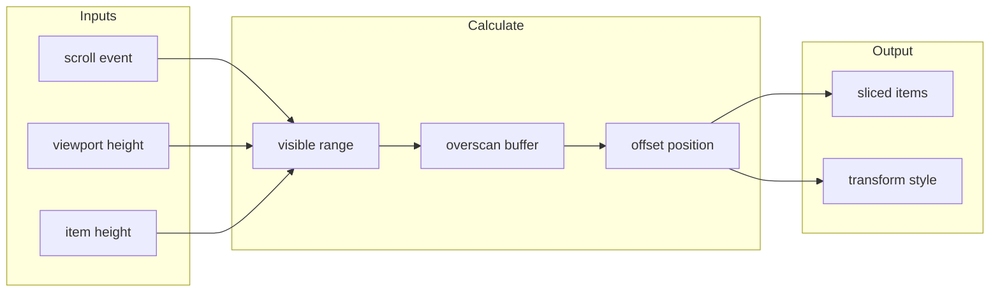

<script setup>
import VirtualListExample from '@/examples/composables/use-virtual/basic.vue'
import VirtualListExampleRaw from '@/examples/composables/use-virtual/basic.vue?raw'
</script>

# useVirtual

Virtual scrolling composable for efficiently rendering large lists by only rendering visible items.

<DocsPageFeatures :frontmatter />

## Overview

The `useVirtual` composable enables high-performance rendering of large datasets (thousands or millions of items) by only rendering the items currently visible in the viewport plus a small overscan buffer. This dramatically reduces DOM nodes and improves performance.

## Usage

<DocsExample file="basic.vue" title="Virtual List" :code="VirtualListExampleRaw">
  <VirtualListExample />
</DocsExample>

## Architecture

The rendering pipeline transforms scroll events into visible item ranges:




<DocsApi />

## Template Structure

The virtual list requires a specific template structure:

```vue UseVirtual
<template>
  <div
    ref="element"
    class="h-[600px] overflow-y-auto"
    @scroll="scroll"
  >
    <!-- Top padding for items before visible range -->
    <div :style="{ height: `${offset}px` }" />

    <!-- Rendered items (only visible ones) -->
    <div
      v-for="item in items"
      :key="item.index"
      class="h-[80px]"
    >
      {{ item.raw }}
    </div>

    <!-- Bottom padding for items after visible range -->
    <div :style="{ height: `${size}px` }" />
  </div>
</template>
```

## Usage Patterns

### Fixed Heights

Most performant option. Specify a fixed `itemHeight`:

```vue UseVirtual
<script setup lang="ts">
  import { shallowRef } from 'vue'
  import { useVirtual } from '@vuetify/v0'

  const items = shallowRef(Array.from({ length: 10000 }, (_, i) => ({
    id: i,
    name: `Item ${i + 1}`,
  })))

  const { element, items: virtualItems, offset, size, scroll } =
    useVirtual(items, {
      itemHeight: 80,
      overscan: 5
    })
</script>

<template>
  <div
    ref="element"
    class="h-[600px] overflow-y-auto"
    @scroll="scroll"
  >
    <div :style="{ height: `${offset}px` }" />

    <div
      v-for="item in virtualItems"
      :key="item.index"
      class="h-[80px] px-4 flex items-center border-b"
    >
      <span class="text-gray-400 mr-4">#{{ item.index + 1 }}</span>
      <span class="font-medium">{{ item.raw.name }}</span>
    </div>

    <div :style="{ height: `${size}px` }" />
  </div>
</template>
```

### Dynamic Heights

For variable item heights, use `itemHeight: null` and measure each item:

```vue UseVirtual
<script setup lang="ts">
  import { shallowRef } from 'vue'
  import { useVirtual, useResizeObserver } from '@vuetify/v0'

  const items = shallowRef(Array.from({ length: 1000 }, (_, i) => ({
    id: i,
    text: i % 3 === 0 ? 'Short' : 'A longer message that wraps...'
  })))

  const { element, items: virtualItems, offset, size, scroll, resize } =
    useVirtual(items, { itemHeight: null })

  function setupItemResize(el: Element | undefined, index: number) {
    if (!el) return
    const { stop } = useResizeObserver(
      shallowRef(el),
      entries => {
        const entry = entries[0]
        if (entry) {
          resize(index, entry.contentRect.height)
        }
      },
      { immediate: true }
    )
    return stop
  }
</script>

<template>
  <div
    ref="element"
    class="h-[600px] overflow-y-auto"
    @scroll="scroll"
  >
    <div :style="{ height: `${offset}px` }" />

    <div
      v-for="item in virtualItems"
      :key="item.index"
      :ref="el => setupItemResize(el as Element, item.index)"
      class="p-4 border-b"
    >
      {{ item.raw.text }}
    </div>

    <div :style="{ height: `${size}px` }" />
  </div>
</template>
```

### Reverse Direction (Chat Apps)

Perfect for chat applications where new messages appear at the bottom:

```vue UseVirtual
<script setup lang="ts">
  import { shallowRef } from 'vue'
  import { useVirtual } from '@vuetify/v0'

  const messages = shallowRef([...])

  const { element, items: virtualItems, offset, size, scroll } =
    useVirtual(messages, {
      itemHeight: 80,
      direction: 'reverse', // Scroll anchored to bottom
    })
</script>
```

**Behavior:**
- Automatically scrolls to bottom on mount
- New items added maintain scroll position
- Ideal for message lists and activity feeds

### Scroll Anchoring

Maintain scroll position when prepending items (e.g., loading older messages):

```vue UseVirtual
<script setup lang="ts">
  import { shallowRef } from 'vue'
  import { useVirtual } from '@vuetify/v0'

  const messages = shallowRef([...])

  const { element, items: virtualItems, offset, size, scroll } =
    useVirtual(messages, {
      itemHeight: 80,
      anchor: 'start', // Maintain position relative to first visible item
      anchorSmooth: true, // Smooth transition
    })

  async function loadOlder() {
    const olderMessages = await fetchOlderMessages()
    messages.value = [...olderMessages, ...messages.value]
    // Scroll position maintained automatically!
  }
</script>
```

### Infinite Scroll

Load more data when scrolling near edges:

```vue UseVirtual
<script setup lang="ts">
  import { shallowRef } from 'vue'
  import { useVirtual } from '@vuetify/v0'

  const items = shallowRef([...])

  const { element, items: virtualItems, offset, size, scroll, state, reset } =
    useVirtual(items, {
      itemHeight: 50,

      onStartReached: async (distance) => {
        if (state.value === 'loading') return

        state.value = 'loading'
        const olderItems = await loadOlderItems()

        if (olderItems.length === 0) {
          state.value = 'empty'
        } else {
          items.value = [...olderItems, ...items.value]
          state.value = 'ok'
        }
      },
      startThreshold: 200, // Trigger when within 200px of top

      onEndReached: async (distance) => {
        if (state.value === 'loading') return

        state.value = 'loading'
        const newerItems = await loadNewerItems()

        if (newerItems.length === 0) {
          state.value = 'empty'
        } else {
          items.value = [...items.value, ...newerItems]
          state.value = 'ok'
        }
      },
      endThreshold: 200, // Trigger when within 200px of bottom
    })
</script>
```

### Enhanced Scroll To

Scroll to specific items with fine-grained control:

```ts
// Basic scroll
scrollTo(100) // Scroll to item 100 (top of viewport)

// Smooth scroll
scrollTo(100, { behavior: 'smooth' })

// Center item in viewport
scrollTo(100, { block: 'center' })

// Align to bottom of viewport
scrollTo(100, { block: 'end' })

// Only scroll if not visible
scrollTo(100, { block: 'nearest' })

// Add custom offset
scrollTo(100, { offset: 50, behavior: 'smooth' })
```

## Performance Tips

1. **Use fixed heights when possible** - Much faster than dynamic measurement
2. **Use `item.index` as key** - More stable than `item.id` for virtual lists
3. **Keep item templates simple** - Minimize DOM complexity per item
4. **Avoid deep reactivity** - Use `shallowRef` for large item arrays
5. **Debounce expensive operations** - Like search/filter on large datasets
6. **Tune overscan for your use case**:
   - **Lower overscan (1-3)** - Better memory usage, may see blank items during fast scrolling
   - **Default overscan (5)** - Balanced for most use cases
   - **Higher overscan (10+)** - Smoother scrolling, uses more memory

## Overscan Configuration

The `overscan` option controls how many extra items are rendered before and after the visible viewport:

```ts
// Low overscan - minimal memory, may see flicker on fast scroll
useVirtual(items, { itemHeight: 50, overscan: 2 })

// Default overscan - balanced (default: 5)
useVirtual(items, { itemHeight: 50 }) // same as overscan: 5

// High overscan - smoothest scrolling, more memory
useVirtual(items, { itemHeight: 50, overscan: 15 })
```

**When to adjust:**
- **Mobile devices**: Lower overscan (2-3) to reduce memory pressure
- **Fast scroll animations**: Higher overscan (10-15) for buttery smooth scrolling
- **Large complex items**: Lower overscan (1-2) if items are heavy to render
- **Simple text rows**: Higher overscan (8-10) since they're cheap to render

## Common Patterns

### Adding Items Dynamically

```ts
const items = shallowRef([...])

// Add more items
items.value = [...items.value, ...newItems]
// Virtual list automatically updates!
```

### Filtering Items

```ts
const items = shallowRef([...])

// Filter items
items.value = items.value.filter(item => item.active)
// Offsets and padding recalculate automatically!
```

## Accessibility

The virtual list itself is headless and provides no ARIA attributes. You should add appropriate ARIA roles based on your use case:

```vue UseVirtual
<div
  ref="element"
  role="list"
  aria-label="Products"
  class="h-[600px] overflow-y-auto"
  @scroll="scroll"
>
  <div :style="{ height: `${offset}px` }" aria-hidden="true" />

  <div
    v-for="item in items"
    :key="item.index"
    role="listitem"
    class="h-[80px]"
  >
    {{ item.raw }}
  </div>

  <div :style="{ height: `${size}px` }" aria-hidden="true" />
</div>
```

## TypeScript

The composable is fully typed:

```ts
import { shallowRef } from 'vue'
import { useVirtual } from '@vuetify/v0'
import type { VirtualOptions, VirtualContext } from '@vuetify/v0'

interface Product {
  id: number
  name: string
  price: number
}

const products = shallowRef<Product[]>([...])

const options: VirtualOptions = {
  itemHeight: 80,
  overscan: 5,
}

const virtual: VirtualContext<Product> = useVirtual(products, options)

// Items are typed as VirtualItem<Product>
virtual.items.value.forEach(item => {
  console.log(item.raw.name) // TypeScript knows about Product properties
})
```

