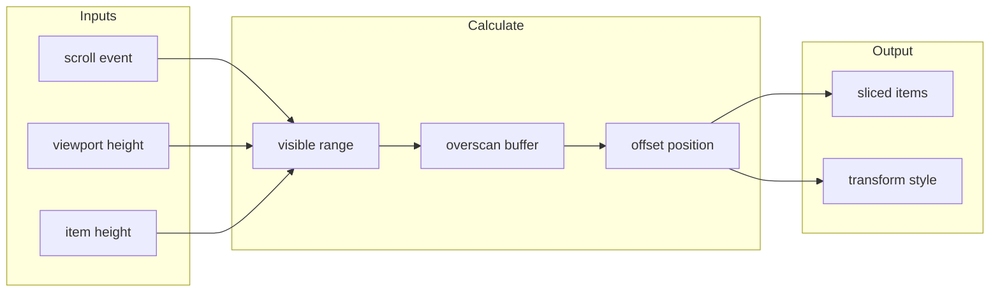

# useVirtual

Virtual scrolling composable for efficiently rendering large lists by only rendering visible items.

<DocsPageFeatures :frontmatter />

## Usage

The `useVirtual` composable efficiently renders large lists by only mounting visible items plus a small overscan buffer. Pass an array of items and configure the item height to get back sliced items, scroll handlers, and positioning values.

<DocsExample file="basic.vue" title="Virtual List" :code="VirtualListExampleRaw">
  <VirtualListExample />
</DocsExample>

## Architecture

The rendering pipeline transforms scroll events into visible item ranges:

<DocsApi />
