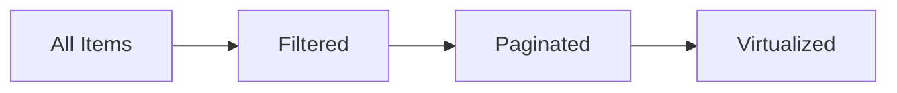

# Utilities

Standalone helpers for common UI patterns. These composables don't depend on context or plugins—use them anywhere.

<DocsPageFeatures :frontmatter />

## Overview

| Utility | Purpose |
| - | - |
| [createFilter](/composables/data/create-filter) | Filter arrays with search queries |
| [createPagination](/composables/data/create-pagination) | Page navigation state |
| [createVirtual](/composables/data/create-virtual) | Virtual scrolling for large lists |
| [createOverflow](/composables/semantic/create-overflow) | Compute visible item capacity |

> [!TIP]
> These utilities are standalone—they don't require plugins or context. Use them anywhere, including outside Vue components.

## createFilter

Filter arrays based on search queries:

```ts
import { createFilter } from '@vuetify/v0'

const items = ref(['Apple', 'Banana', 'Cherry'])
const query = ref('')

const filter = createFilter()
const { items: filtered } = filter.apply(query, items)

query.value = 'an'
filtered.value  // ['Banana']
```

### With Object Keys

```ts
const users = ref([
  { name: 'Alice', email: 'alice@example.com' },
  { name: 'Bob', email: 'bob@example.com' },
])

const filter = createFilter({
  keys: ['name', 'email'],
})

const query = ref('alice')
const { items: filtered } = filter.apply(query, users)
filtered.value  // [{ name: 'Alice', ... }]
```

### Filter Modes

```ts
const filter = createFilter({
  mode: 'intersection',  // 'some' | 'every' | 'union' | 'intersection'
  keys: ['name', 'tags'],
})
```

## createPagination

Pagination state management:

```ts
import { createPagination } from '@vuetify/v0'

const pagination = createPagination({
  size: 100,
  itemsPerPage: 10,
})

pagination.page.value     // 1
pagination.pages          // 10
pagination.isFirst.value  // true
pagination.isLast.value   // false

pagination.next()         // Go to page 2
pagination.prev()         // Go to page 1
pagination.select(5)      // Go to page 5
pagination.first()        // Go to page 1
pagination.last()         // Go to page 10
```

### With Reactive Size

```ts
const items = ref([...])

const pagination = createPagination({
  size: () => items.value.length,
  itemsPerPage: 20,
})
```

### Page Items

```ts
pagination.items.value  // [{ type: 'page', value: 1 }, { type: 'page', value: 2 }, ...]
```

## createVirtual

Virtual scrolling for large datasets:

```ts
import { createVirtual } from '@vuetify/v0'

const items = ref(Array.from({ length: 10000 }, (_, i) => `Item ${i}`))

// createVirtual takes items as first arg, options as second
const virtual = createVirtual(items, {
  itemHeight: 40,
})
```

```vue playground VirtualList.vue
<template>
  <div ref="virtual.element" style="height: 400px; overflow: auto;">
    <div :style="{ height: `${virtual.size}px`, paddingTop: `${virtual.offset}px` }">
      <div
        v-for="item in virtual.items"
        :key="item.index"
        style="height: 40px"
      >
        {{ item.raw }}
      </div>
    </div>
  </div>
</template>
```

### Variable Height

```ts
const virtual = createVirtual(items, {
  height: 400,  // Container height (or use element ref)
})
```

## createOverflow

Compute how many items fit in a container:

```ts
import { createOverflow } from '@vuetify/v0'
import { useTemplateRef } from 'vue'

const containerRef = useTemplateRef<HTMLElement>('container')

const overflow = createOverflow({
  container: containerRef,
  itemWidth: 100,
  gap: 8,
})

overflow.capacity.value       // Number of items that fit
overflow.isOverflowing.value  // Boolean: items exceed capacity
```

### Use Case: Responsive Chips

```vue playground ResponsiveChips.vue
<template>
  <div ref="container" class="flex gap-2">
    <span v-for="tag in visibleTags" :key="tag" class="chip">
      {{ tag }}
    </span>
    <span v-if="overflow.isOverflowing.value" class="chip">
      +{{ tags.length - overflow.capacity.value }}
    </span>
  </div>
</template>

<script setup>
  const tags = ['Vue', 'React', 'Angular', 'Svelte', 'Solid']
  const visibleTags = computed(() => tags.slice(0, overflow.capacity.value))
</script>
```

## Transformers

Value transformation utilities:

### toArray

Normalize any value to an array:

```ts
import { toArray } from '@vuetify/v0'

toArray('single')      // ['single']
toArray(['array'])     // ['array']
toArray(null)          // []
toArray(undefined)     // []
```

### toReactive

Convert ref objects to reactive proxies:

```ts
import { toReactive } from '@vuetify/v0'

const configRef = ref({ debug: false })

// Unwraps the ref and returns a reactive object
const config = toReactive(configRef)

config.debug  // Reactive access
```

## Color

Color manipulation utilities for hex and RGB formats.

### hexToRgb / rgbToHex

Convert between hex strings and `RGB` objects:

```ts
import { hexToRgb, rgbToHex } from '@vuetify/v0'

hexToRgb('#1976d2')  // { r: 25, g: 118, b: 210 }
hexToRgb('#fff')     // { r: 255, g: 255, b: 255 }

rgbToHex({ r: 25, g: 118, b: 210 })  // '#1976d2'
```

The `RGB` interface is available for typing:

```ts
import type { RGB } from '@vuetify/v0'

const color: RGB = { r: 255, g: 0, b: 0 }
```

### APCA Contrast

[APCA](https://github.com/Myndex/SAPC-APCA) (Advanced Perceptual Contrast Algorithm) for accessible color pairings. Returns a signed contrast value — higher magnitude means more contrast:

```ts
import { apca, foreground, hexToRgb } from '@vuetify/v0'

// Raw APCA contrast between two colors
const text = hexToRgb('#1a1a1a')
const bg   = hexToRgb('#ffffff')
apca(text, bg)  // ~-106 (high contrast, dark on light)

// Pick black or white text for a background
foreground('#1976d2')  // '#ffffff' (white reads better on this blue)
foreground('#ffd600')  // '#000000' (black reads better on yellow)
```

> [!TIP]
> `foreground` is ideal for computing on-color text in design tokens. It uses APCA to select the higher-contrast option.

## Best Practices

### Combine Utilities

```ts
// Filter + Paginate
const query = ref('')
const filter = createFilter()
const { items: filtered } = filter.apply(query, items)

const pagination = createPagination({
  size: () => filtered.value.length,
  itemsPerPage: 10,
})

const displayedItems = computed(() => {
  const start = pagination.pageStart.value
  const end = pagination.pageStop.value
  return filtered.value.slice(start, end)
})
```

### Virtual + Filter

```ts
const query = ref('')
const filter = createFilter()
const { items: filtered } = filter.apply(query, items)

const virtual = createVirtual(filtered, {
  itemHeight: 40,
})
```

### Filter + Pagination + Virtual

For large datasets that need all three utilities working together:

```ts collapse
import { shallowRef, computed } from 'vue'
import { createFilter, createPagination, createVirtual } from '@vuetify/v0'

// Source data
const items = shallowRef(Array.from({ length: 10000 }, (_, i) => ({
  id: i,
  name: `Item ${i}`,
})))

// 1. Filter first
const query = shallowRef('')
const filter = createFilter({ keys: ['name'] })
const { items: filtered } = filter.apply(query, items)

// 2. Paginate the filtered results
const pagination = createPagination({
  size: () => filtered.value.length,
  itemsPerPage: 100,
})

// 3. Get current page slice
const pageItems = computed(() => {
  const start = pagination.pageStart.value
  const end = pagination.pageStop.value
  return filtered.value.slice(start, end)
})

// 4. Virtual scroll the current page
const virtual = createVirtual(pageItems, { itemHeight: 40 })
```

```vue
<template>
  <input v-model="query" placeholder="Search..." />

  <div ref="virtual.element" style="height: 400px; overflow: auto;">
    <div :style="{ height: `${virtual.size}px`, paddingTop: `${virtual.offset}px` }">
      <div v-for="item in virtual.items" :key="item.raw.id" style="height: 40px">
        {{ item.raw.name }}
      </div>
    </div>
  </div>

  <Pagination :pagination="pagination" />
</template>
```



Each layer is reactive—changing the search query refilters, which updates pagination, which updates the virtual list.

## Type Guards

Type-narrowing functions that replace raw `typeof` / `===` checks. All are tree-shakeable.

```ts
import { isString, isNullOrUndefined, isObject } from '@vuetify/v0'

if (isString(value)) {
  // value is string
}

if (!isNullOrUndefined(x)) {
  // x is defined
}
```

| Guard | Narrows to |
| - | - |
| `isFunction(x)` | `Function` |
| `isString(x)` | `string` |
| `isNumber(x)` | `number` (includes NaN) |
| `isBoolean(x)` | `boolean` |
| `isObject(x)` | `Record<string, unknown>` (excludes null and arrays) |
| `isArray(x)` | `unknown[]` |
| `isElement(x)` | `Element` |
| `isNull(x)` | `null` |
| `isUndefined(x)` | `undefined` |
| `isNullOrUndefined(x)` | `null \| undefined` |
| `isPrimitive(x)` | `string \| number \| boolean` |
| `isSymbol(x)` | `symbol` |
| `isNaN(x)` | `number` (only the NaN value)[^isnan-vs-global] |

[^isnan-vs-global]: `isNaN` here uses `Number.isNaN()` internally — it does not coerce strings like the global `isNaN()`. `isNaN("foo")` returns `false`, not `true`.

> [!TIP]
> Prefer these over raw comparisons.

## Helpers

General-purpose utilities for numbers, arrays, and objects.

### clamp

Clamp a number between a minimum and maximum:

```ts
import { clamp } from '@vuetify/v0'

clamp(15, 0, 10)  // 10
clamp(-5, 0, 10)  // 0
clamp(5, 0, 10)   // 5
clamp(0.5)         // 0.5 (defaults: min=0, max=1)
```

### range

Create an array of sequential numbers:

```ts
import { range } from '@vuetify/v0'

range(5)      // [0, 1, 2, 3, 4]
range(3, 1)   // [1, 2, 3]
range(5, 10)  // [10, 11, 12, 13, 14]
range(0)      // []
```

### mergeDeep

Deep-merge objects without mutating inputs. Arrays are replaced, not concatenated:

```ts
import { mergeDeep } from '@vuetify/v0'

mergeDeep({ a: { b: 1 } }, { a: { c: 2 } })
// { a: { b: 1, c: 2 } }

mergeDeep({}, { a: 1 }, { b: 2 })
// { a: 1, b: 2 }

mergeDeep({ arr: [1, 2] }, { arr: [3] })
// { arr: [3] }
```

### useId

SSR-safe unique ID generation. Uses Vue's `useId()` inside components, falls back to a counter outside:

```ts
import { useId } from '@vuetify/v0'

// In component setup
const id = useId()  // 'v:0' (Vue's format)

// Outside component
const id = useId()  // 'v0-0', 'v0-1', ...
```

