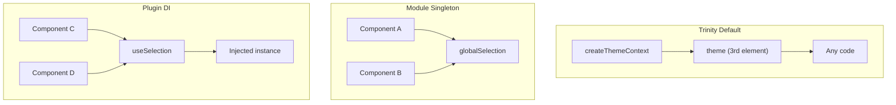
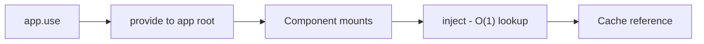

# Composables

Composables are the foundation of v0. They provide headless logic that you can use directly or through wrapper components.

<DocsPageFeatures :frontmatter />

## Composables vs Components

Both approaches use the same underlying logic:

```ts
// Direct composable usage
const selection = createSelection({ multiple: true })
selection.register({ id: 'a', value: 'Apple' })
selection.select('a')
```

```vue playground
<template>
  <Selection.Root v-model="selected" multiple>
    <Selection.Item value="Apple">Apple</Selection.Item>
  </Selection.Root>
</template>
```

### When to Use Each

| Use Composables When | Use Components When |
| - | - |
| Need full control over rendering | Want declarative templates |
| Building custom abstractions | Standard UI patterns |
| Non-DOM contexts (stores, workers) | Accessibility attrs needed |
| Maximum flexibility | Faster development |

> [!TIP]
> Components and composables are interchangeable. Every component uses a composable internally—you can always drop to the composable for more control.

> [!ASKAI] How do I choose between composables and components for my use case?

## Quick Reactivity Note

v0 uses **minimal reactivity** for performance. Unlike Vue's default approach where everything is deeply reactive, v0 only makes reactive what *must* be reactive.

**Selection state is always reactive** — `selectedId`, `selectedIds`, and `isSelected` update your templates automatically. This covers 90% of use cases.

**Registry collections are NOT reactive by default** — methods like `registry.values()` return snapshots. If you need template updates when items change, wrap with `useProxyRegistry()`:

```ts
// ❌ Won't update template when items change
const items = registry.values()

// ✅ Reactive — template updates automatically
const proxy = useProxyRegistry(registry)
// Use proxy.values in your template
```

> [!TIP]
> This is intentional! Most apps only need selection reactivity.
> For the full picture, see the [Reactivity Guide](/guide/fundamentals/reactivity).

## Categories

### Foundation

Factories that create other composables:

| Composable | Purpose |
| - | - |
| [createContext](/composables/foundation/create-context) | Type-safe provide/inject |
| [createTrinity](/composables/foundation/create-trinity) | `[use, provide, context]` tuple |
| [createPlugin](/composables/foundation/create-plugin) | Vue plugin factory |

### Registration

Collection management primitives:

| Composable | Purpose |
| - | - |
| [createRegistry](/composables/registration/create-registry) | Base collection with lookup |
| [createTokens](/composables/registration/create-tokens) | Design token aliases |
| [createQueue](/composables/registration/create-queue) | Time-based queue |
| [createTimeline](/composables/registration/create-timeline) | Undo/redo history |

### Selection

State management for selection patterns:

| Composable | Purpose |
| - | - |
| [createSelection](/composables/selection/create-selection) | Multi-select base |
| [createSingle](/composables/selection/create-single) | Radio, tabs, accordion |
| [createGroup](/composables/selection/create-group) | Checkboxes, tri-state |
| [createStep](/composables/selection/create-step) | Wizard, stepper, carousel |

### Forms

Form state and validation:

| Composable | Purpose |
| - | - |
| [createForm](/composables/forms/create-form) | Validation, dirty tracking |

### Reactivity

Reactive proxy utilities:

| Composable | Purpose |
| - | - |
| [useProxyModel](/composables/reactivity/use-proxy-model) | v-model bridge |
| [useProxyRegistry](/composables/reactivity/use-proxy-registry) | Registry to reactive object |

### Plugins

App-level features installed via `app.use()`:

| Composable | Purpose |
| - | - |
| [useTheme](/composables/plugins/use-theme) | Dark/light mode |
| [useLocale](/composables/plugins/use-locale) | i18n, RTL |
| [useBreakpoints](/composables/plugins/use-breakpoints) | Responsive queries |
| [useStorage](/composables/plugins/use-storage) | Persistent state |

### Utilities

Standalone helpers:

| Composable | Purpose |
| - | - |
| [createFilter](/composables/data/create-filter) | Array filtering |
| [createPagination](/composables/data/create-pagination) | Page navigation |
| [createVirtual](/composables/data/create-virtual) | Virtual scrolling |

## Usage Patterns

### Direct Factory Call

For standalone instances:

```ts
import { createSelection } from '@vuetify/v0'

const tabs = createSelection({ multiple: false })
tabs.register({ id: 'home', value: 'Home' })
tabs.register({ id: 'about', value: 'About' })
tabs.select('home')
```

### Context Injection

For component tree sharing:

```ts
// Parent
import { createSelectionContext } from '@vuetify/v0'

const [useTabSelection, provideTabSelection] = createSelectionContext({
  namespace: 'tabs',
  multiple: false,
})
provideTabSelection()

// Child
const selection = useTabSelection()
selection.select('home')
```

### Plugin Installation

For app-wide singletons:

```ts main.ts
import { createApp } from 'vue'
import { createThemePlugin } from '@vuetify/v0'

const app = createApp(App)
app.use(
  createThemePlugin({
    default: 'light',
    themes: { light: {...}, dark: {...} },
  }),
)
```

## Composing Composables

Build complex behavior by combining primitives:

```ts composables/useDataTable.ts
import { createSelection, createFilter, createPagination } from '@vuetify/v0'

// Filterable, paginated selection
const items = ref([...])
const query = ref('')

const filter = createFilter()
const { items: filtered } = filter.apply(query, items)

const pagination = createPagination({
  size: () => filtered.value.length,
  itemsPerPage: 10,
})
const selection = createSelection({ multiple: true })

// Visible items with selection state
const visibleItems = computed(() => {
  const start = pagination.pageStart.value
  const end = pagination.pageStop.value
  return filtered.value.slice(start, end)
})
```

## TypeScript

All composables are fully typed. The value type is inferred from registration:

```ts
interface MyItem {
  id: string
  label: string
}

const selection = createSelection()
selection.register({ id: '1', value: { id: '1', label: 'First' } as MyItem })

// Type-safe access via ticket
const ticket = selection.get('1')
ticket?.value // MyItem
```

> [!ASKAI] Which composables should I use for a data table with filtering and pagination?

## Frequently Asked Questions

::: faq
??? Should I always use context injection or can I call factories directly?

Both are valid. Choose based on scope:

| Pattern | When to Use |
| - | - |
| Direct factory | Local state, single component, testing |
| Context injection | Shared state across component tree |
| Plugin installation | App-wide singletons |

```ts
// Direct - local to this component
const localSelection = createSelection()

// Context - shared with descendants
const [useSelection, provideSelection] = createSelectionContext()
provideSelection() // Children can now useSelection()
```

Direct calls are simpler when you don't need to share state. See [Core](/guide/fundamentals/core) for context patterns.

??? Can I share a composable instance across multiple component trees?

Yes. Three approaches depending on your needs:

**Trinity's third element** — Built-in shared instance:

```ts
const [useTheme, provideTheme, theme] = createThemeContext()

// 'theme' is the shared default instance
// Access it anywhere without injection
theme.current.value // Works outside components, in tests, etc.
```

**Module singleton** — Export a factory result:

```ts singleton.ts
export const globalSelection = createSelection({ multiple: true })
```

**Plugin installation** — App-wide via dependency injection:

```ts main.ts
app.use(createSelectionPlugin({ multiple: true }))
```



Trinity's third element is the idiomatic v0 approach—see [The Trinity Pattern](/guide/fundamentals/core#the-trinity-pattern) for details. Module singletons work outside Vue. Plugins integrate with devtools.

??? What's the lifecycle of a composable when components unmount?

Composables follow Vue's reactivity lifecycle:

1. **Created** — Factory call allocates refs and state
2. **Active** — Reactive updates propagate normally
3. **Cleanup** — When the creating component unmounts, `onUnmounted` hooks run

```ts
const selection = createSelection()

// Registered items persist until explicitly unregistered
selection.register({ id: 'a', value: 1 })

onUnmounted(() => {
  // Manual cleanup if needed
  selection.unregister('a')
})
```

For context-provided composables, the instance lives as long as the providing component. Child components that inject don't affect the lifecycle.

??? Is there a performance penalty for plugin-based composables?

Minimal. Plugin installation runs once at app startup:



The injection is a single Map lookup, same as any `inject()` call. There's no per-render overhead—you're accessing the same object reference.

??? Can I mix multiple composables together safely?

Yes. Composables are designed for composition:

```ts
import {
  createSelection,
  createFilter,
  createPagination,
} from '@vuetify/v0'

// Each composable manages its own state
const selection = createSelection({ multiple: true })
const filter = createFilter()
const pagination = createPagination({ itemsPerPage: 10 })

// Wire them together
const filtered = filter.apply(query, items)
const paginated = computed(() =>
  filtered.value.slice(pagination.pageStart.value, pagination.pageStop.value)
)
```

Each composable is independent. They don't interfere with each other unless you explicitly connect them. See [Composing Composables](#composing-composables) above for patterns.

??? How do I debug composable state in Vue DevTools?

Composables using Vue's reactivity show up in DevTools automatically. For better debugging:

1. **Named refs** — Use `ref()` with descriptive variable names
2. **Custom inspector** — Plugins registered via `app.use()` appear in DevTools
3. **Console logging** — Refs are reactive, use `toRaw()` for snapshots

```ts
import { toRaw } from 'vue'

const selection = createSelection()
console.log(toRaw(selection.selectedIds)) // Plain Set, not reactive proxy
```

For registry-based composables, enable `events: true` to trace registration changes via [useProxyRegistry](/composables/reactivity/use-proxy-registry).
:::
