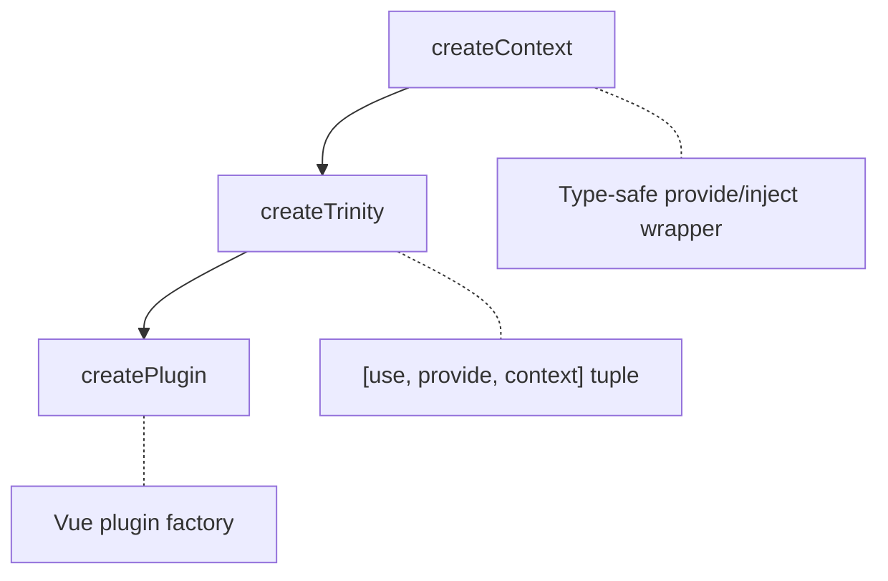
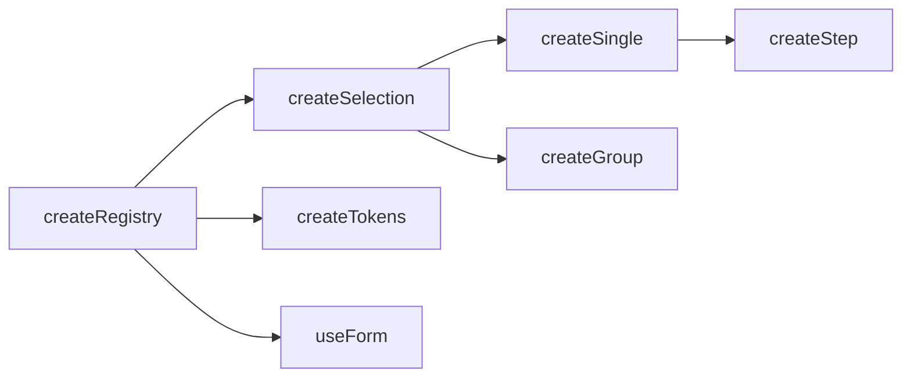

# Core

v0's core architecture provides type-safe dependency injection and composable patterns. This page explains **how v0 works**. For creating plugins, see [Plugins Guide](/guide/fundamentals/plugins).

<DocsPageFeatures :frontmatter />

## Architecture Overview



## The Trinity Pattern

The signature pattern of v0. Every composable returns a readonly 3-tuple:

```ts
const [useTheme, provideTheme, theme] = createThemeContext()

// 1. useTheme - Inject from ancestor
const theme = useTheme()

// 2. provideTheme - Provide to descendants
provideTheme()              // Use defaults
provideTheme(customTheme)   // Provide custom

// 3. theme - Direct access without DI
theme.cycle()  // Cycle through themes
```

### Why Three Elements?

| Element | Purpose |
| - | - |
| `useContext` | Consume in child components |
| `provideContext` | Provide from parent (defaults to built-in context) |
| `defaultContext` | Standalone access, testing, outside Vue |

> [!TIP]
> The third element (`defaultContext`) is useful for unit testing without mounting Vue components.

## createContext

Type-safe wrapper around Vue's provide/inject that **throws on missing context** (no silent undefined):

### Static Key Mode

```ts
const [useTheme, provideTheme] = createContext<ThemeContext>('v0:theme')

// Provider
provideTheme({ isDark: ref(false), toggle: () => {} })

// Consumer - throws if not provided
const theme = useTheme()
```

### Dynamic Key Mode

For nested contexts (panels within panels):

```ts
const [usePanel, providePanel] = createContext<PanelContext>()

// Provider with runtime key
providePanel('panel-1', context)

// Consumer with same key
const panel = usePanel('panel-1')
```

### Suffix Pattern

For parent-child context hierarchies:

```ts
const [useItem, provideItem] = createContext<ItemContext>({ suffix: 'item' })

provideItem('v0:panel', context)  // Provides to 'v0:panel:item'
useItem('v0:panel')               // Injects from 'v0:panel:item'
```

## Registry System

`createRegistry` is the foundational data structure. All selection, forms, and token composables extend it.

```ts
const registry = createRegistry()

// Register items
const ticket = registry.register({ id: 'item-1', value: 'First' })

// Lookup
registry.get('item-1')      // Get by ID
registry.browse('First')    // Get IDs by value
registry.lookup(0)          // Get ID by index

// Cleanup
registry.unregister('item-1')
```

### Ticket Structure

Every registered item is a "ticket":

```ts
interface RegistryTicket {
  id: ID,              // Unique identifier
  index: number,       // Position in registry
  value: unknown,      // Associated data
  valueIsIndex: boolean, // True if value wasn't explicitly set
}
```

### Extension Chain



| Composable | Extends | Adds |
| - | - | - |
| `createRegistry` | — | Base collection management |
| `createSelection` | Registry | `selectedIds` Set |
| `createSingle` | Selection | Single selection constraint |
| `createGroup` | Selection | Tri-state, batch ops |
| `createStep` | Single | Navigation (next/prev/first/last) |
| `createTokens` | Registry | Alias resolution |
| `useForm` | Registry | Validation |

## Selection System

### createSelection

Base multi-selection with Set-based tracking:

```ts
const selection = createSelection({ multiple: true })

selection.register({ id: 'a', value: 'Apple' })
selection.register({ id: 'b', value: 'Banana' })

selection.select('a')
selection.selectedIds  // Set { 'a' }
```

### createSingle

Auto-clears previous selection:

```ts
const tabs = createSingle({ mandatory: true })

tabs.onboard([
  { id: 'tab-1', value: 'Home' },
  { id: 'tab-2', value: 'About' },
])

tabs.select('tab-1')
tabs.select('tab-2')  // tab-1 auto-unselected
tabs.selectedId.value // 'tab-2'
```

### createGroup

Multi-select with tri-state:

```ts
const checkboxes = createGroup()

checkboxes.onboard([
  { id: 'a', value: 'Option A' },
  { id: 'b', value: 'Option B' },
  { id: 'c', value: 'Option C' },
])

checkboxes.select(['a', 'b'])
checkboxes.selectAll()
checkboxes.isMixed.value  // true when some (not all) selected
```

### createStep

Sequential navigation:

```ts
const wizard = createStep({ circular: false })

wizard.onboard([
  { id: 'step-1', value: 'Step 1' },
  { id: 'step-2', value: 'Step 2' },
  { id: 'step-3', value: 'Step 3' },
])

wizard.first()  // Select first step
wizard.next()   // Move forward
wizard.prev()   // Move backward
wizard.last()   // Jump to end
```

## Best Practices

### Naming Conventions

| Prefix | Purpose | Example |
| - | - | - |
| `use*` | Inject from context | `useTheme()` |
| `create*` | Factory returning instance | `createSelection()` |
| `create*Context` | Factory returning trinity | `createThemeContext()` |
| `create*Plugin` | Factory returning Vue plugin | `createThemePlugin()` |

### When to Use Each

| Need | Use |
| - | - |
| Share state in component tree | `provideContext` / `useContext` |
| App-wide singleton | `createPlugin` with `app.use()` |
| Standalone logic | Direct factory call |
| Testing | Trinity's third element |

> [!SUGGESTION] How do I handle scoped contexts for nested components without prop drilling?
