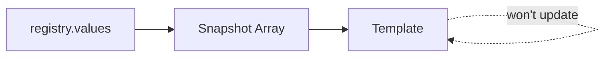
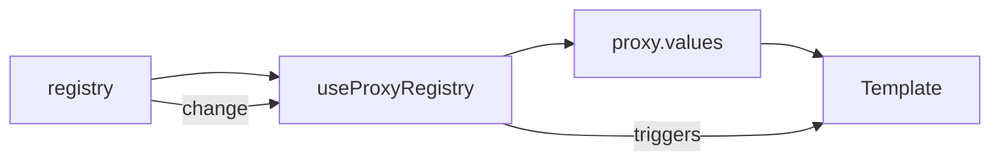

# Reactivity

v0 inverts Vue's reactivity model: **only what MUST be reactive, IS reactive.**

<DocsPageFeatures :frontmatter />

## The Philosophy

Vue makes everything deeply reactive by default. This is powerful but has costs—memory overhead, change detection cycles, and potential for unnecessary re-renders.

v0 takes the opposite approach: start non-reactive, opt in when needed. This gives you:

- **Predictable performance** — No hidden reactivity costs
- **Smaller bundle** — Less reactive wrapper overhead
- **Full control** — You decide what triggers updates

> [!TIP]
> Most apps only need selection reactivity, which v0 provides automatically. The minimal approach matters for large collections and high-frequency operations.

## The Reactivity Spectrum

| Non-Reactive | Opt-In Reactive | Always Reactive |
|:------------:|:---------------:|:---------------:|
| `registry.values()` | `useProxyRegistry()` | `selectedIds` |
| `registry.keys()` | `events.on()` | `selectedId` |
| `registry.size` | `toReactive()` | `isSelected` |

<p class="text-center text-medium-emphasis">← Less overhead · More overhead →</p>

### Non-Reactive

Raw data access with no Vue reactivity overhead. When you call `registry.values()`, you get a plain array snapshot — fast to read, but templates won't auto-update when items change.



**When to use:** Static lists, server-rendered content, or when you control all mutations and can trigger updates manually. Also ideal for large datasets where you want to avoid reactive overhead.

---

### Opt-In Reactive

When you need template reactivity for collections, wrap your registry with `useProxyRegistry()`. The proxy subscribes to registry events internally and exposes reactive getters.



**When to use:** Dynamic lists that change after mount, real-time data, or any UI that needs to reflect collection changes automatically. The proxy handles the subscription lifecycle for you.

---

### Always Reactive

Selection state (`selectedId`, `selectedIds`, `isSelected`) is always reactive — no opt-in required. This covers the 90% use case: tabs, lists, steppers, and any UI where users select items.


**When to use:** Anytime you're building selection-based UI. Just use the selection composables directly — reactivity is built in.

## What's Reactive by Default

Selection composables are fully reactive out of the box:

| Composable | Reactive Properties |
| - | - |
| [createSelection](/composables/selection/create-selection) | `selectedIds`, ticket `isSelected` |
| [createSingle](/composables/selection/create-single) | `selectedId`, ticket `isSelected` |
| [createGroup](/composables/selection/create-group) | `selectedIds`, `indeterminate` |
| [createStep](/composables/selection/create-step) | `selectedId`, `canPrev`, `canNext` |

```ts
import { createSingle } from '@vuetify/v0'

const tabs = createSingle()
tabs.onboard([
  { id: 'home', value: 'Home' },
  { id: 'settings', value: 'Settings' },
])

// ✅ Reactive - templates update automatically
tabs.selectedId  // Ref<string | null>
```

```vue playground collapse
<script setup>
  import { createSingle } from '@vuetify/v0'

  const tabs = createSingle()
  tabs.onboard([
    { id: 'home', value: 'Home' },
    { id: 'settings', value: 'Settings' },
  ])
</script>

<template>
  <div class="d-flex gap-2">
    <button
      v-for="ticket in tabs.values()"
      :key="ticket.id"
      :class="{ active: ticket.isSelected.value }"
      @click="tabs.select(ticket.id)"
    >
      {{ ticket.value }}
    </button>
  </div>
  <p>Selected: {{ tabs.selectedId }}</p>
</template>

<style scoped>
  .active { background: var(--v-primary); color: white; }
</style>
```

## What's NOT Reactive

Registry collections and computed properties are **not** reactive by default:

| Property | Why Not Reactive |
| - | - |
| `registry.values()` | Read-heavy; rarely needs live updates |
| `registry.keys()` | Same as values—snapshot, not reactive |
| `registry.size` | Computed on access; cheap to recalculate |
| `registry.has(id)` | Point lookup; use events for change detection |
| Queue/Timeline data | Consumed via events or polling |

This is intentional. Most UI patterns only need to react to *selection changes*, not *collection changes*. When the collection itself changes (items added/removed), you typically know about it—you're the one calling `register()`.

## Opting Into Reactivity

When you need reactive collections, v0 provides three patterns.

### Pattern 1: reactive option

Enable reactivity at creation time with `{ reactive: true }`:

```ts
import { createRegistry } from '@vuetify/v0'

const registry = createRegistry({ reactive: true })

// Now collection access is reactive
registry.values()  // Triggers reactivity
registry.size      // Triggers reactivity
```

```vue playground
<script setup>
  import { createRegistry } from '@vuetify/v0'

  const registry = createRegistry({ reactive: true })

  let count = 0
  function onAdd() {
    registry.register({
      id: `item-${count++}`,
      value: `Item ${count}`,
    })
  }
</script>

<template>
  <button @click="onAdd">Add Item</button>
  <p>Count: {{ registry.size }}</p>
  <ul>
    <li v-for="item in registry.values()" :key="item.id">
      {{ item.value }}
    </li>
  </ul>
</template>
```

> [!TIP]
> The `reactive` option uses `shallowReactive` internally—top-level changes trigger updates, but nested object mutations won't.

### Pattern 2: Events

Subscribe to specific changes imperatively:

```ts
import { createRegistry } from '@vuetify/v0'

const registry = createRegistry({ events: true })

registry.on('register:ticket', function (ticket) {
  console.log('Added:', ticket.id)
})

registry.on('unregister:ticket', function (ticket) {
  console.log('Removed:', ticket.id)
})
```

Events are lightweight and precise—you react only to what you care about.

### Pattern 3: useProxyRegistry

Wrap any registry for full template reactivity:

```ts
import { createRegistry, useProxyRegistry } from '@vuetify/v0'

const registry = createRegistry({ events: true })
const proxy = useProxyRegistry(registry)

// proxy.values is now reactive
// proxy.keys is now reactive
// proxy.size is now reactive
```

```vue playground
<script setup>
  import { createRegistry, useProxyRegistry } from '@vuetify/v0'

  const registry = createRegistry({ events: true })
  const proxy = useProxyRegistry(registry)

  let count = 0
  function onAdd() {
    registry.register({
      id: `item-${count++}`,
      value: `Item ${count}`,
    })
  }
</script>

<template>
  <button @click="onAdd">Add Item</button>
  <p>Count: {{ proxy.size }}</p>
  <ul>
    <li v-for="item in proxy.values" :key="item.id">
      {{ item.value }}
    </li>
  </ul>
</template>
```

> [!TIP]
> `useProxyRegistry` requires `{ events: true }` on the registry. The proxy subscribes to these events to provide reactivity.

## Common Pitfalls

### Expecting template updates from registry methods

```vue
<template>
  <!-- Won't update when items are added/removed! -->
  <div v-for="item in registry.values()" :key="item.id">
    {{ item.value }}
  </div>
</template>
```

The template renders once with the initial values. Adding items via `registry.register()` won't trigger a re-render because `values()` returns a non-reactive array.

### Use the proxy for reactive collections

```vue
<script setup>
  import { createRegistry, useProxyRegistry } from '@vuetify/v0'

  const registry = createRegistry({ events: true })
  const proxy = useProxyRegistry(registry)
</script>

<template>
  <div v-for="item in proxy.values" :key="item.id">
    {{ item.value }}
  </div>
</template>
```

### Watching non-reactive data

```ts
// This watch will never fire!
watch(
  () => registry.values(),
  values => console.log('Updated:', values)
)
```

### Use events or proxy for change detection

```ts
import { watch } from 'vue'
import { useProxyRegistry } from '@vuetify/v0'

// Option 1: Events
registry.on('register:ticket', function () {
  console.log('Registry changed')
})

// Option 2: Watch the proxy
const proxy = useProxyRegistry(registry)
watch(
  () => proxy.values,
  values => console.log('Updated:', values)
)
```

### Using registry.size in computed

```ts
// Won't update!
const hasItems = computed(() => registry.size > 0)
```

### Use proxy.size

```ts
const proxy = useProxyRegistry(registry)
const hasItems = computed(() => proxy.size > 0)
```

## Performance Implications

Minimal reactivity isn't just a design choice—it has measurable impact.

### Benchmark: Bulk Registration

Registering items in batch, comparing `reactive: false` vs `reactive: true`:

| Items | Non-Reactive | Reactive | Slowdown |
| -: | -: | -: | :-: |
| 1,000 | <AppIcon icon="benchmark-blazing" class="text-error" :size="16" /> 0.78ms | <AppIcon icon="benchmark-fast" class="text-warning" :size="16" /> 1.92ms | 2.5x |
| 5,000 | <AppIcon icon="benchmark-blazing" class="text-error" :size="16" /> 2.14ms | <AppIcon icon="benchmark-good" class="text-info" :size="16" /> 9.55ms | **4.5x** |

```vue playground collapse
<script setup>
  import { ref } from 'vue'
  import { createRegistry } from '@vuetify/v0'

  const results = ref({ nonReactive: 0, reactive: 0 })
  const count = ref(1000)

  function runBenchmark() {
    // Non-reactive
    const reg1 = createRegistry()
    const start1 = performance.now()
    for (let i = 0; i < count.value; i++) {
      reg1.register({ id: `item-${i}`, value: i })
    }
    results.value.nonReactive = (performance.now() - start1).toFixed(2)

    // Reactive
    const reg2 = createRegistry({ reactive: true })
    const start2 = performance.now()
    for (let i = 0; i < count.value; i++) {
      reg2.register({ id: `item-${i}`, value: i })
    }
    results.value.reactive = (performance.now() - start2).toFixed(2)
  }
</script>

<template>
  <div class="d-flex align-center gap-4 mb-4">
    <input v-model.number="count" type="number" step="500" min="100" max="10000" style="width: 100px" />
    <span>items</span>
    <button @click="runBenchmark">Run Benchmark</button>
  </div>
  <div v-if="results.nonReactive">
    <p><strong>Non-reactive:</strong> {{ results.nonReactive }}ms</p>
    <p><strong>Reactive:</strong> {{ results.reactive }}ms</p>
    <p><strong>Ratio:</strong> {{ (results.reactive / results.nonReactive).toFixed(1) }}x slower</p>
  </div>
</template>
```

For most apps (<1,000 items), either approach works fine. For large datasets or frequent updates (>60/s), the minimal approach shines.

See [Benchmarks](/guide/fundamentals/benchmarks) for detailed measurements and methodology.

### When to Use Each Pattern

| Use Case | Recommended Pattern |
| - | - |
| Selection UI (tabs, lists) | Built-in reactivity <AppSuccessIcon /> |
| Static lists that rarely change | Non-reactive `values()` |
| Dynamic lists in templates | `useProxyRegistry` |
| Debugging/logging | Events |
| Large datasets (>1,000 items) | Non-reactive + manual refresh |
| Real-time updates | Events + targeted updates |

> [!ASKAI] Should I use useProxyRegistry or events for a list of 500 items that updates every few seconds?

## Frequently Asked Questions

::: faq
??? Why doesn't v0 just make everything reactive like Vue?

Performance and predictability. Vue's deep reactivity is convenient but has costs:

1. **Memory** — Every object gets wrapped in a Proxy
2. **CPU** — Change detection runs on every mutation
3. **Bundle** — Reactive wrappers add code weight
4. **Debugging** — Hard to trace what triggered a re-render

v0 targets headless UI infrastructure—it might power 50+ components in an app. Keeping the base minimal ensures those components stay fast. When you need reactivity, opt in explicitly.

??? Should I always use useProxyRegistry?

No. Use it when you need template reactivity for collections. If you're:

- Only using selection state → Built-in reactivity is enough
- Iterating once at mount → Non-reactive is fine
- Building your own reactive layer → Events give more control

??? How do I know if something is reactive?

Rule of thumb:

| If it's... | It's reactive |
| - | - |
| `selectedId`, `selectedIds` | <AppSuccessIcon /> Yes |
| `isSelected` on a ticket | <AppSuccessIcon /> Yes |
| `canPrev`, `canNext` | <AppSuccessIcon /> Yes |
| `.values()`, `.keys()`, `.size` | <AppErrorIcon /> No |
| Anything from `useProxyRegistry` | <AppSuccessIcon /> Yes |

When in doubt, check the composable's API reference—each documents its reactivity behavior.

??? Can I mix reactive and non-reactive access?

Yes. The proxy wraps the same underlying registry:

```ts
const registry = createRegistry({ events: true })
const proxy = useProxyRegistry(registry)

// Both access the same data
registry.register({ id: 'a', value: 1 })
proxy.values  // [{ id: 'a', value: 1 }]
registry.values()  // [{ id: 'a', value: 1 }]
```

Use non-reactive access for performance-critical reads, proxy for template bindings.

??? What about reactivity with Pinia or other stores?

v0 composables work alongside any state management. If you're storing a registry in Pinia:

```ts
// In Pinia store
const registry = createRegistry({ events: true })
const proxy = useProxyRegistry(registry)

// Expose proxy for reactive access
return { registry, proxy }
```

The proxy provides Vue reactivity; Pinia provides persistence and devtools integration. They complement each other.
:::
