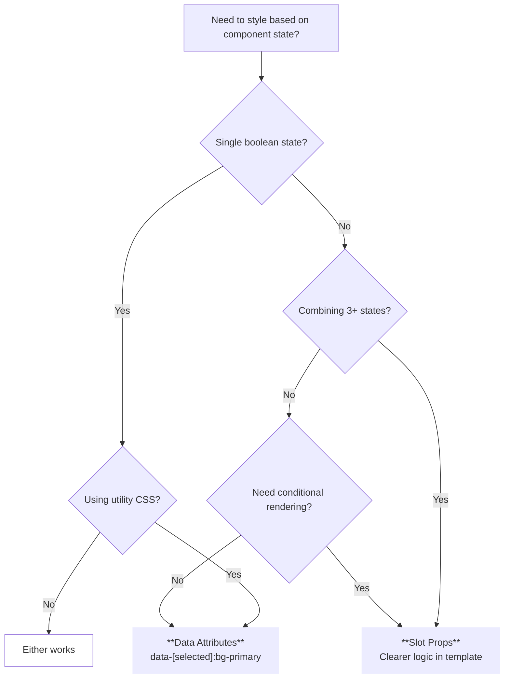

<script setup>
import DataAttributesExample from '@/examples/guide/styling/data-attributes.vue'
import DataAttributesExampleRaw from '@/examples/guide/styling/data-attributes.vue?raw'
import CssModulesExample from '@/examples/guide/styling/css-modules.vue'
import CssModulesExampleRaw from '@/examples/guide/styling/css-modules.vue?raw'
import SlotPropsExample from '@/examples/guide/styling/slot-props.vue'
import SlotPropsExampleRaw from '@/examples/guide/styling/slot-props.vue?raw'
import TransitionsExample from '@/examples/guide/styling/transitions.vue'
import TransitionsExampleRaw from '@/examples/guide/styling/transitions.vue?raw'
import CompoundStatesExample from '@/examples/guide/styling/compound-states.vue'
import CompoundStatesExampleRaw from '@/examples/guide/styling/compound-states.vue?raw'
</script>

# Styling Headless Components

v0 components are headless—they provide behavior and accessibility, you provide the styling. This guide covers two first-class patterns for styling based on component state.

<DocsPageFeatures :frontmatter />

## Two Approaches

v0 exposes component state in two ways:

| Approach | Syntax | Best For |
| - | - | - |
| **Data Attributes** | `data-[selected]:bg-primary` | Simple states, utility-first CSS |
| **Slot Props** | `:class="{ 'bg-primary': isSelected }"` | Complex conditions, computed styles |

Both approaches work with any CSS framework. Data attributes are set automatically via the `attrs` [object](/guide/fundamentals/components#slot-props-pattern)—slot props give you reactive booleans for template logic.

> [!TIP]
> Start with data attributes. They're simpler and keep styling in CSS where it belongs. Reach for slot props only when you need complex conditional logic.

## Data Attributes Reference

All v0 components expose state via `data-*` attributes in the `attrs` object:

| Component | Attributes | Notes |
| - | - | - |
| [Selection](/components/providers/selection)<br>[Single](/components/providers/single)<br>[Group](/components/providers/group) | <span class="whitespace-nowrap">`data-selected`</span><br><span class="whitespace-nowrap">`data-disabled`</span> | Set on items |
| [Group](/components/providers/group) | <span class="whitespace-nowrap">`data-mixed`</span> | Tri-state only |
| [Tabs](/components/disclosure/tabs) | <span class="whitespace-nowrap">`data-selected`</span><br><span class="whitespace-nowrap">`data-disabled`</span> | Tab items |
| [ExpansionPanel](/components/disclosure/expansion-panel) | <span class="whitespace-nowrap">`data-selected`</span><br><span class="whitespace-nowrap">`data-disabled`</span> | Activator element |
| [Checkbox](/components/forms/checkbox) | <span class="whitespace-nowrap">`data-state`</span><br><span class="whitespace-nowrap">`data-disabled`</span> | `checked` `unchecked` `indeterminate` |
| [Radio](/components/forms/radio) | <span class="whitespace-nowrap">`data-state`</span><br><span class="whitespace-nowrap">`data-disabled`</span> | `checked` `unchecked` |
| [Popover](/components/disclosure/popover) | <span class="whitespace-nowrap">`data-popover-open`</span> | Activator element |
| [Dialog](/components/disclosure/dialog) | <span class="whitespace-nowrap">`data-dialog-open`</span> | Activator element |

> [!INFO]
> Attributes are only present when `true`. Use `[data-selected]` not `[data-selected="true"]`.

> [!ASKAI] What data attributes does Selection.Item expose and how do I style them?

## Styling with Data Attributes

Data attribute selectors let you style based on state purely in CSS. This works with [Tailwind](/introduction/getting-started#tailwind), [UnoCSS](/introduction/getting-started#unocss), plain CSS, or any framework supporting attribute selectors.

### Tailwind / UnoCSS

Use the `data-[attr]:` [variant](https://unocss.dev/transformers/variant-group) to apply classes when an attribute is present:

<DocsExample file="data-attributes.vue" :code="DataAttributesExampleRaw">
  <DataAttributesExample />
</DocsExample>

### CSS Modules

Target data attributes in your [module styles](https://vuejs.org/api/sfc-css-features#css-modules):

<DocsExample file="css-modules.vue" :code="CssModulesExampleRaw">
  <CssModulesExample />
</DocsExample>

### Plain CSS

Standard [attribute selectors](https://developer.mozilla.org/en-US/docs/Web/CSS/Attribute_selectors) work in any stylesheet:

```css
/* Single state */
[data-selected] {
  background: var(--v0-primary);
  color: var(--v0-on-primary);
}

/* Compound states */
[data-selected][data-disabled] {
  background: color-mix(in srgb, var(--v0-primary) 60%, transparent);
  cursor: not-allowed;
}
```

> [!TIP]
> CSS Modules pair well with [theme tokens](/guide/features/theming#css-variables). Use `var(--v0-*)` for consistent theming across your app.

## Styling with Slot Props

[Slot props](/guide/fundamentals/components#slot-props-pattern) provide reactive state as JavaScript booleans. Use them when you need:

- **Multiple dependent states**: `isSelected && !isDisabled && isFocused`
- **Computed class names** from external logic
- **Conditional rendering** (icons, badges, text)
- **Dynamic inline styles** (progress bars, animations)

<DocsExample file="slot-props.vue" :code="SlotPropsExampleRaw">
  <SlotPropsExample />
</DocsExample>

> [!WARNING]
> Always spread `attrs` on your interactive element. It contains [ARIA attributes](/guide/features/accessibility) required for accessibility, plus data attributes for CSS styling.

## Advanced Patterns

### Transitions

Add CSS transitions for smooth state changes:

<DocsExample file="transitions.vue" :code="TransitionsExampleRaw">
  <TransitionsExample />
</DocsExample>

### Focus States

Combine focus-visible with selection state for keyboard navigation feedback:

```vue
<template>
  <Tabs.Item
    class="focus-visible:ring-2 focus-visible:ring-primary focus-visible:ring-offset-2
           data-[selected]:bg-primary"
    :value="item"
  >
    {{ item }}
  </Tabs.Item>
</template>
```

### Compound States

Style combinations using CSS attribute selectors:

<DocsExample file="compound-states.vue" :code="CompoundStatesExampleRaw">
  <CompoundStatesExample />
</DocsExample>

### Parent-Child Styling

Use Tailwind's `group` utilities to style children based on parent state:

```vue
<template>
  <Tabs.Item class="group inline-flex items-center gap-2" :value="item">
    <span class="group-data-[selected]:font-bold">{{ item }}</span>
    <CheckIcon class="size-4 opacity-0 group-data-[selected]:opacity-100 transition-opacity" />
  </Tabs.Item>
</template>
```

## When to Use Which



> [!TIP]
> When in doubt, start with data attributes. Refactor to slot props only if the conditional logic becomes unwieldy.
