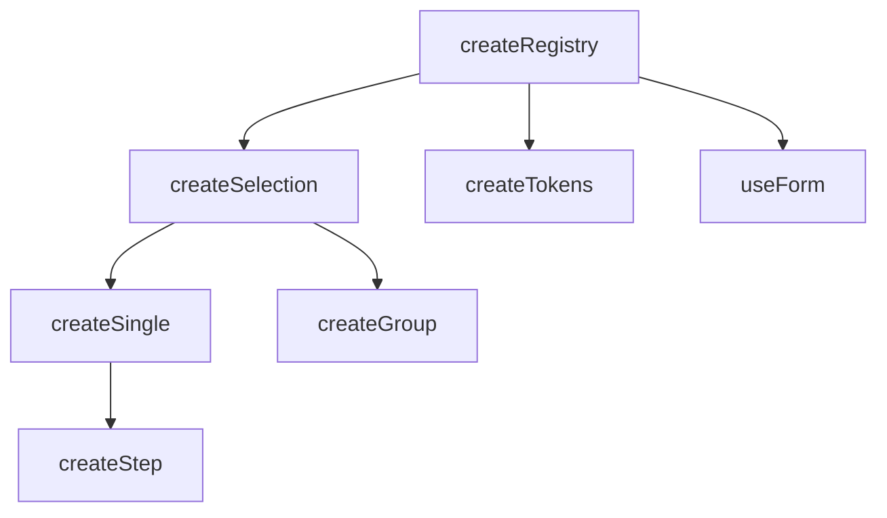

# Structure

Quick reference for v0's codebase organization. Use this when navigating the source or deciding where to add new features.

<DocsPageFeatures :frontmatter />

## Package Layout

```txt
@vuetify/v0 (packages/0/src/)
├── components/       # Vue component wrappers (one folder per component)
├── composables/      # Core logic (flat structure, one folder per composable)
│   ├── createContext/
│   ├── createRegistry/
│   ├── createSelection/
│   └── ...           # All composables at same level
├── constants/        # Shared constants (IN_BROWSER, etc.)
├── types/            # Shared TypeScript types
├── utilities/        # Helper functions
└── index.ts          # Public exports
```

> [!TIP]
> Composables use a flat directory structure. The categories below are logical groupings for documentation purposes only.

## Composable Categories

| Category | Purpose | Key Exports |
| - | - | - |
| **foundation** | Core factories | `createContext`, `createTrinity`, `createPlugin` |
| **registration** | Collection management | `createRegistry`, `createTokens`, `useQueue`, `useTimeline` |
| **selection** | Selection state | `createSelection`, `createSingle`, `createGroup`, `createStep` |
| **forms** | Form handling | `useForm` |
| **reactivity** | Reactive proxies | `useProxyModel`, `useProxyRegistry` |
| **system** | Browser APIs | `useEventListener`, `useHotkey`, `useResizeObserver`, `useClickOutside`, `useIntersectionObserver`, `useMutationObserver`, `useToggleScope` |
| **plugins** | App features | `useTheme`, `useLocale`, `useLogger`, `useStorage`, `useBreakpoints`, `useFeatures`, `useHydration`, `usePermissions` |
| **utilities** | UI helpers | `useFilter`, `usePagination`, `useVirtual`, `useOverflow` |
| **transformers** | Value transforms | `toArray`, `toReactive` |

## Component Categories

| Category | Purpose | Components |
| - | - | - |
| **primitives** | Base building blocks | `Atom` |
| **providers** | Pure state, no DOM | `Selection`, `Single`, `Group`, `Step` |
| **semantic** | Meaningful HTML | `Avatar`, `Pagination` |
| **disclosure** | Show/hide patterns | `ExpansionPanel`, `Popover` |

## Import Patterns

### Named Imports

```ts
import { createSelection, createThemePlugin, Atom } from '@vuetify/v0'
```

### Compound Components

```ts
import { Selection, ExpansionPanel } from '@vuetify/v0'

// Usage: Selection.Root, Selection.Item
// Usage: ExpansionPanel.Root, ExpansionPanel.Item, ExpansionPanel.Header,
//        ExpansionPanel.Activator, ExpansionPanel.Content
```

## File Conventions

### Composables

```txt
composables/
└── createSelection/
    ├── index.ts              # Main composable
    └── index.test.ts         # Colocated tests
```

### Components

```txt
components/
└── Selection/
    ├── SelectionRoot.vue     # Container component
    ├── SelectionItem.vue     # Child component
    ├── index.ts              # Compound export + re-exports
    └── index.test.ts         # Colocated tests
```

## Naming Conventions

| Prefix | Purpose | Example |
| - | - | - |
| `use*` | Composable (inject from context) | `useTheme()` |
| `create*` | Factory returning instance | `createSelection()` |
| `create*Context` | Factory returning trinity | `createThemeContext()` |
| `create*Plugin` | Factory returning Vue plugin | `createThemePlugin()` |
| `to*` | Value transformer | `toArray()`, `toReactive()` |

## Extension Hierarchy



> [!SUGGESTION] When should I use createSelection vs createSingle vs createGroup for my use case?
