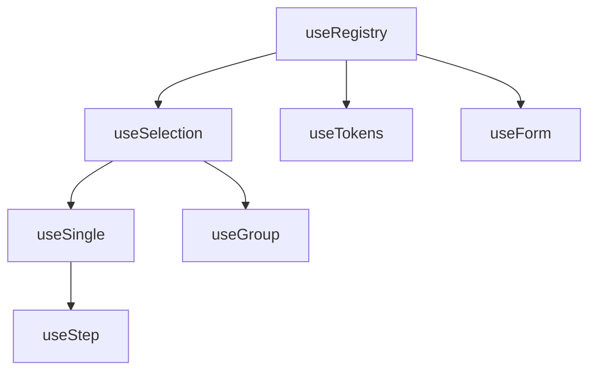

# Structure

Quick reference for v0's codebase organization. Use this when navigating the source or deciding where to add new features.

<DocsPageFeatures :frontmatter />

## Package Layout

```
@vuetify/v0 (packages/0/src/)
├── components/       # Vue component wrappers
├── composables/      # Core logic
│   ├── foundation/   # createContext, createTrinity, createPlugin
│   ├── registration/ # useRegistry, useTokens, useQueue, useTimeline
│   ├── selection/    # useSelection, useSingle, useGroup, useStep
│   ├── forms/        # useForm, useProxyModel
│   ├── system/       # Browser API wrappers
│   ├── plugins/      # App-level features (theme, locale, etc.)
│   ├── utilities/    # useFilter, usePagination, useVirtual, useOverflow
│   └── transformers/ # toArray, toReactive
├── types/            # Shared TypeScript types
└── index.ts          # Public exports
```

## Composable Categories

| Category | Purpose | Key Exports |
| - | - | - |
| **foundation** | Core factories | `createContext`, `createTrinity`, `createPlugin` |
| **registration** | Collection management | `useRegistry`, `useTokens`, `useQueue`, `useTimeline` |
| **selection** | Selection state | `useSelection`, `useSingle`, `useGroup`, `useStep` |
| **forms** | Form handling | `useForm`, `useProxyModel` |
| **system** | Browser APIs | `useEventListener`, `useKeydown`, `useResizeObserver` |
| **plugins** | App features | `useTheme`, `useLocale`, `useLogger`, `useStorage` |
| **utilities** | UI helpers | `useFilter`, `usePagination`, `useVirtual`, `useOverflow` |
| **transformers** | Value transforms | `toArray`, `toReactive` |

## Component Categories

| Category | Purpose | Components |
| - | - | - |
| **primitives** | Base building blocks | `Atom` |
| **providers** | Pure state, no DOM | `Selection`, `Single`, `Group`, `Step` |
| **semantic** | Meaningful HTML | `Avatar`, `Pagination` |
| **disclosure** | Show/hide patterns | `ExpansionPanel`, `Popover` |

## Import Patterns

### Named Imports

```ts
import { useSelection, createTheme, Atom } from '@vuetify/v0'
```

### Compound Components

```ts
import { Selection, ExpansionPanel } from '@vuetify/v0'

// Usage: Selection.Root, Selection.Item
// Usage: ExpansionPanel.Root, ExpansionPanel.Activator, ExpansionPanel.Content
```

## File Conventions

### Composables

```
composables/
└── useSelection/
    ├── index.ts              # Main composable
    └── index.test.ts         # Colocated tests
```

### Components

```
components/
└── Selection/
    ├── SelectionRoot.vue     # Container component
    ├── SelectionItem.vue     # Child component
    ├── Selection.ts          # Compound export
    ├── index.ts              # Re-exports
    └── index.test.ts         # Colocated tests
```

## Naming Conventions

| Prefix | Purpose | Example |
| - | - | - |
| `use*` | Composable (inject from context) | `useTheme()` |
| `create*` | Factory returning instance | `createSelection()` |
| `create*Context` | Factory returning trinity | `createThemeContext()` |
| `create*Plugin` | Factory returning Vue plugin | `createThemePlugin()` |
| `to*` | Value transformer | `toArray()`, `toReactive()` |

## Extension Hierarchy



