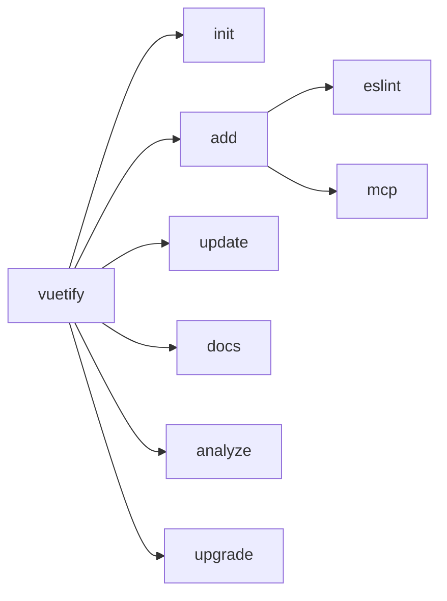
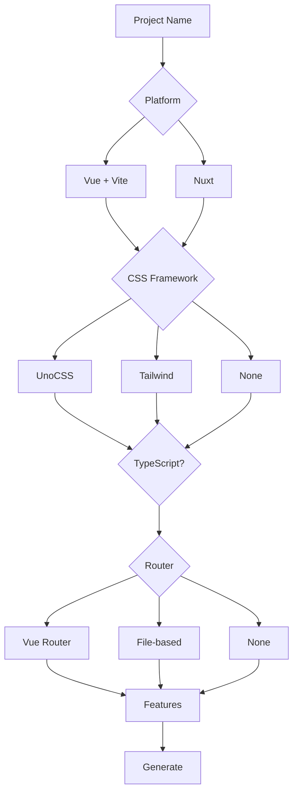

# Vuetify CLI

The Vuetify CLI is a tooling ecosystem for scaffolding and managing Vuetify projects. It provides interactive project generation, intelligent dependency updates, and codebase analysis.

<DocsPageFeatures :frontmatter />

## Packages

| Package | Binary | Purpose |
| - | - | - |
| [@vuetify/cli](https://www.npmjs.com/package/@vuetify/cli) | `vuetify` | Full CLI with all commands |
| [create-vuetify0](https://www.npmjs.com/package/create-vuetify0) | `create-vuetify0` | Scaffold [v0](/introduction/getting-started) projects |

## Quick Start

Create a new v0 project with the interactive wizard:

::: code-group

```bash pnpm no-filename
pnpm create vuetify0
```

```bash npm no-filename
npm create vuetify0
```

```bash yarn no-filename
yarn create vuetify0
```

```bash bun no-filename
bun create vuetify0
```

:::

## Commands



### init

Initialize a new project (wrapper around `create-vuetify0`):

::: code-group

```bash pnpm no-filename
pnpm dlx @vuetify/cli init my-app
```

```bash npm no-filename
npx @vuetify/cli init my-app
```

```bash yarn no-filename
yarn dlx @vuetify/cli init my-app
```

```bash bun no-filename
bunx @vuetify/cli init my-app
```

:::

### add

Add integrations to existing projects:

::: code-group

```bash pnpm no-filename
# Add ESLint with Vuetify config
pnpm dlx @vuetify/cli add eslint

# Add MCP server configuration
pnpm dlx @vuetify/cli add mcp
```

```bash npm no-filename
# Add ESLint with Vuetify config
npx @vuetify/cli add eslint

# Add MCP server configuration
npx @vuetify/cli add mcp
```

```bash yarn no-filename
# Add ESLint with Vuetify config
yarn dlx @vuetify/cli add eslint

# Add MCP server configuration
yarn dlx @vuetify/cli add mcp
```

```bash bun no-filename
# Add ESLint with Vuetify config
bunx @vuetify/cli add eslint

# Add MCP server configuration
bunx @vuetify/cli add mcp
```

:::

> [!TIP]
> The `add mcp` command configures [Vuetify MCP](/guide/tooling/vuetify-mcp) for your IDE automatically.

### update

Update all Vuetify packages to their latest versions:

::: code-group

```bash pnpm no-filename
# Update to latest stable
pnpm dlx @vuetify/cli update

# Update to nightly builds
pnpm dlx @vuetify/cli update --nightly
```

```bash npm no-filename
npx @vuetify/cli update
npx @vuetify/cli update --nightly
```

```bash yarn no-filename
yarn dlx @vuetify/cli update
yarn dlx @vuetify/cli update --nightly
```

```bash bun no-filename
bunx @vuetify/cli update
bunx @vuetify/cli update --nightly
```

:::

The update command auto-detects and updates:

- `vuetify`
- `@vuetify/*` packages
- `vuetify-nuxt-module`
- `vite-plugin-vuetify`
- `eslint-plugin-vuetify`

### docs

Open version-specific Vuetify documentation:

::: code-group

```bash pnpm no-filename
pnpm dlx @vuetify/cli docs
```

```bash npm no-filename
npx @vuetify/cli docs
```

```bash yarn no-filename
yarn dlx @vuetify/cli docs
```

```bash bun no-filename
bunx @vuetify/cli docs
```

:::

> [!INFO]
> The CLI auto-detects your installed Vuetify version and opens the correct documentation site.

### analyze

Scan your codebase for Vuetify usage patterns:

::: code-group

```bash pnpm no-filename
# Console output
pnpm dlx @vuetify/cli analyze

# JSON output for tooling
pnpm dlx @vuetify/cli analyze --reporter json
```

```bash npm no-filename
npx @vuetify/cli analyze
npx @vuetify/cli analyze --reporter json
```

```bash yarn no-filename
yarn dlx @vuetify/cli analyze
yarn dlx @vuetify/cli analyze --reporter json
```

```bash bun no-filename
bunx @vuetify/cli analyze
bunx @vuetify/cli analyze --reporter json
```

:::

The analyzer detects imports of:

- Components (`VBtn`, `VCard`, etc.)
- Composables (`useDisplay`, `useTheme`, etc.)
- Types and utilities

> [!ASKAI] How can I use the analyze command to plan a Vuetify migration?

### upgrade

Self-upgrade the CLI to the latest version:

::: code-group

```bash pnpm no-filename
pnpm dlx @vuetify/cli upgrade
```

```bash npm no-filename
npx @vuetify/cli upgrade
```

```bash yarn no-filename
yarn dlx @vuetify/cli upgrade
```

```bash bun no-filename
bunx @vuetify/cli upgrade
```

:::

## Scaffolding Options

The interactive wizard guides you through project configuration:



### Platforms

| Platform | Description |
| - | - |
| Vue + Vite | Standard Vue 3 SPA with [Vite](https://vite.dev) |
| Nuxt | [Nuxt 3/4](https://nuxt.com) with SSR/SSG support |

### CSS Frameworks

| Framework | Description |
| - | - |
| [UnoCSS](https://unocss.dev) | Instant atomic CSS engine |
| [Tailwind](https://tailwindcss.com) | Utility-first CSS |
| None | No CSS framework |

### Router Options (Vue only)

| Option | Description |
| - | - |
| [Vue Router](https://router.vuejs.org) | Standard routing |
| File-based | Auto-generated routes from file structure |
| None | No routing |

### Features

| Feature | Description |
| - | - |
| ESLint | [Vuetify ESLint config](https://github.com/vuetifyjs/eslint-config-vuetify) |
| [Pinia](https://pinia.vuejs.org) | State management |
| [i18n](https://vue-i18n.intlify.dev) | Internationalization |
| MCP | [Vuetify MCP](/guide/tooling/vuetify-mcp) server config |
| Nuxt Module | [vuetify-nuxt-module](https://github.com/userquin/vuetify-nuxt-module) (Nuxt only) |

## Non-Interactive Mode

For CI/CD pipelines and automation, pass arguments directly:

::: code-group

```bash pnpm no-filename
pnpm create vuetify0 my-app \
  --platform vue \
  --css unocss \
  --typescript \
  --router router \
  --features eslint,pinia \
  --package-manager pnpm \
  --install
```

```bash npm no-filename
npm create vuetify0 my-app -- \
  --platform vue \
  --css unocss \
  --typescript \
  --router router \
  --features eslint,pinia \
  --package-manager npm \
  --install
```

```bash yarn no-filename
yarn create vuetify0 my-app \
  --platform vue \
  --css unocss \
  --typescript \
  --router router \
  --features eslint,pinia \
  --package-manager yarn \
  --install
```

```bash bun no-filename
bun create vuetify0 my-app \
  --platform vue \
  --css unocss \
  --typescript \
  --router router \
  --features eslint,pinia \
  --package-manager bun \
  --install
```

:::

### All Arguments

| Argument | Values | Description |
| - | - | - |
| `--platform` | `vue`, `nuxt` | Target platform |
| `--css` | `unocss`, `tailwindcss`, `none` | CSS framework |
| `--typescript` | flag | Enable TypeScript |
| `--router` | `router`, `file-router`, `none` | Router type (Vue only) |
| `--features` | comma-separated | Features to include |
| `--package-manager` | `pnpm`, `npm`, `yarn`, `bun` | Package manager |
| `--install` | flag | Auto-install dependencies |
| `--force` | flag | Overwrite existing directory |

> [!WARNING]
> The `--force` flag will overwrite existing files without confirmation.
