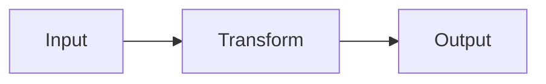
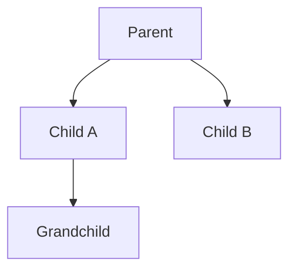
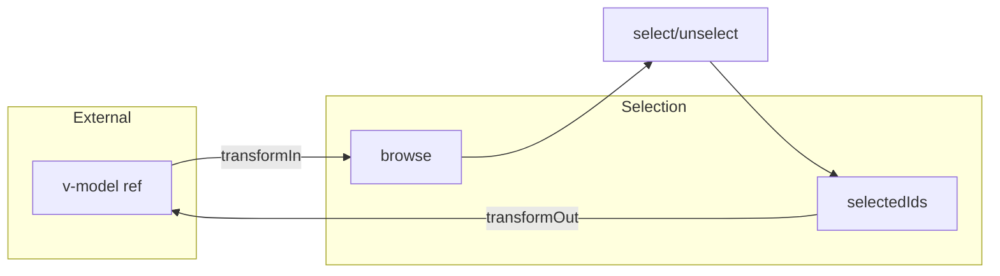

<script setup>
import GroupExample from '@/examples/components/group/basic.vue'
import GroupExampleRaw from '@/examples/components/group/basic.vue?raw'
</script>

# Using the Docs

<DocsPageFeatures :frontmatter />

This guide helps you get the most out of v0 documentation. Whether you're exploring headless components for the first time or diving deep into composable architecture, these features will accelerate your learning.

**Key features:**

- **Ask AI** — Context-aware assistant that knows every page
- **Skill filtering** — Show content matching your experience level
- **Interactive examples** — Live demos with editable code
- **Keyboard-first** — Navigate entirely without a mouse

## Documentation Structure

The docs are organized into distinct sections, each serving a specific purpose:

<!-- TODO:  -->

| Section | Purpose | When to use |
|---------|---------|-------------|
| <AppLink to="/guide" class="whitespace-nowrap"><AppIcon icon="book" :size="18" class="inline-block align-text-bottom mr-1" />**Guide**</AppLink> | Conceptual learning | Understanding architecture, patterns, best practices |
| <AppLink to="/components" class="whitespace-nowrap"><AppIcon icon="layers" :size="18" class="inline-block align-text-bottom mr-1" />**Components**</AppLink> | Headless UI primitives | Building accessible interfaces (Dialog, Popover, Selection) |
| <AppLink to="/composables" class="whitespace-nowrap"><AppIcon icon="puzzle" :size="18" class="inline-block align-text-bottom mr-1" />**Composables**</AppLink> | Logic building blocks | Adding behavior without UI (createContext, createSelection) |
| <AppLink to="/api" class="whitespace-nowrap"><AppIcon icon="toc" :size="18" class="inline-block align-text-bottom mr-1" />**API**</AppLink> | Complete reference | Looking up props, events, slots, methods |
| <AppLink to="/storybook" class="whitespace-nowrap"><AppIcon icon="test" :size="18" class="inline-block align-text-bottom mr-1" />**Storybook**</AppLink> | Visual playground | Exploring component variants interactively |

Each component and composable page follows a consistent structure: overview, usage examples, anatomy, and API reference.

## Skill Levels & Learning Tracks { #skill-levels-learning-tracks }

Use the filter to show only pages matching your experience level: <AppSkillFilter />

### Skill Levels

Every page is tagged with a skill level to help you find content appropriate for your experience:

| Level | Badge | For |
|-------|-------|-----|
| <span class="inline-block w-3 h-3 rounded bg-success mr-1 align-middle" />**1** | Beginner | New to v0, learning fundamentals |
| <span class="inline-block w-3 h-3 rounded bg-info mr-1 align-middle" />**2** | Intermediate | Building with components, practical usage |
| <span class="inline-block w-3 h-3 rounded bg-warning mr-1 align-middle" />**3** | Advanced | Architecture deep-dives, custom patterns |

### Learning Tracks

The [Guide overview](/guide) defines three learning tracks for structured progression:

**Track A: Core Concepts** — Understanding the system
1. [Structure](/guide/structure) Package organization and imports
2. [Core](/guide/core) Trinity, Context, and Registry patterns
3. [Components](/guide/components) Headless primitives and slot props
4. [Plugins](/guide/plugins) Vue plugin integration

**Track B: Features & Polish** — Production-ready UIs
1. [Theming](/guide/theming) CSS variables and design tokens
2. [Accessibility](/guide/accessibility) ARIA patterns and keyboard navigation
3. [Utilities](/guide/utilities) Helper functions and type guards

**Track C: Real-World Application** — See v0 in production
1. [Building Docs](/guide/building-docs) How this documentation site uses v0

New to v0? Start with Track A. Already building? Jump to Track B as needed.

## Navigation

### Table of Contents

The right sidebar (desktop only) shows an outline of the current page:

- Auto-generated from H2, H3, and H4 headings
- **Scroll spy**: Highlights your current section as you read
- Click any heading to jump directly to that section

### Related Links

At the bottom of each page, you'll find links to related content. These cross-references help you discover connected concepts and navigate between related components and composables.

<DocsRelated :frontmatter="{ related: ['/guide/ai-tools', '/introduction/getting-started'] }" />

### Previous / Next

Footer navigation at the bottom of each page links to adjacent pages in the current section, allowing linear reading through the documentation.

<DocsNavigator />

<br>

## Search

### Opening Search

- Click the search button in the header ("Search the docs...")
- Press `Ctrl+K` (Windows/Linux) or `Cmd+K` (Mac)

<!-- TODO:  -->

### Using Search

The search system uses **fuzzy matching**, so typos and partial words still find results:

- `"creat contxt"` finds `createContext`
- `"dialg"` finds `Dialog`
- `"selec"` finds `Selection`, `createSelection`

Results are grouped by category, with Guide pages prioritized. Maximum 20 results are shown per query.

### Keyboard Navigation

| Key | Action |
|-----|--------|
| `↑` / `↓` | Navigate through results |
| `Enter` | Go to selected result |
| `Escape` | Close search |

> [!TIP] Search indexes page titles, headings, and content. For API lookups, try searching the exact function or component name.

## Ask AI

The documentation includes a context-aware AI assistant that understands v0 concepts and has access to the current page's content.

<!-- TODO:  -->

### Opening Ask AI

- Click the floating input at the bottom of any page
- Press `Ctrl+/` (Windows/Linux) or `Cmd+/` (Mac)

On desktop, the chat opens as a right-side panel. On mobile, it opens as a full-screen modal.

### What the AI Knows

The AI has access to the entire v0 documentation via [llms-full.txt](/guide/ai-tools), but prioritizes the current page for more relevant answers:

| Context | Description |
|---------|-------------|
| <AppIcon icon="book" :size="16" class="inline-block align-text-bottom" /> **Full docs** | Complete documentation available for cross-referencing |
| <AppIcon icon="typescript" :size="16" class="inline-block align-text-bottom" /> **Examples** | Live Vue code from the page's interactive demos |
| <AppIcon icon="toc" :size="16" class="inline-block align-text-bottom" /> **API specs** | Props, events, slots, and methods for the current component/composable |
| <AppIcon icon="benchmark" :size="16" class="inline-block align-text-bottom" /> **Benchmarks** | Performance metrics (for composables) |
| <AppIcon icon="chat" :size="16" class="inline-block align-text-bottom" /> **History** | Your last 6 messages in the conversation |

This context makes answers specific and actionable. Asking "How do I open this programmatically?" on the Dialog page gives you Dialog-specific code.

### SUGGESTION Callouts

Throughout the documentation, you'll find clickable "Ask AI" boxes:

> [!SUGGESTION] How do I add styling or CSS classes to headless components?

These are pre-written questions relevant to the current topic. Click one to instantly send it to Ask AI.

### Chat Features

- <AppIcon icon="send" :size="16" class="inline-block align-text-bottom" /> **Streaming**: Responses appear in real-time as they're generated
- <AppIcon icon="markdown" :size="16" class="inline-block align-text-bottom" /> **Markdown**: Responses include formatted code with syntax highlighting
- <AppIcon icon="map" :size="16" class="inline-block align-text-bottom" /> **Diagrams**: Mermaid diagrams render inline when relevant
- <AppIcon icon="copy" :size="16" class="inline-block align-text-bottom" /> **Copy**: Copy the entire conversation to clipboard
- <AppIcon icon="vuetify-bin" :size="16" class="inline-block align-text-bottom" /> **Bin**: Save to Vuetify Bin for sharing
- <AppIcon icon="stop" :size="16" class="inline-block align-text-bottom" /> **Stop**: Cancel generation mid-stream if needed

The AI can generate syntax-highlighted code blocks and Mermaid diagrams directly in responses. Ask for architecture diagrams, data flow visualizations, or working code examples.

> [!TIP] Ask AI works best on component and composable pages where it has access to examples and API data. For general questions, try the Guide pages.

### Example Prompts

Click any suggestion to send it to Ask AI:

- > [!SUGGESTION] Show me how to use Dialog with v-model
- > [!SUGGESTION] What's the difference between createSelection and createGroup?
- > [!SUGGESTION] Explain the slot props for Step.Item

Or type your own question:

<AppAskInline />

<br>

## Interactive Examples

Most component and composable pages include live, interactive examples.

<!-- TODO:  -->

### Live Previews

Examples render as functional components you can interact with directly:

- Click buttons, open dialogs, select items
- See real behavior without leaving the docs
- Examples use the same code shown below them

<DocsExample file="basic.vue" title="Interactive Group Example" :code="GroupExampleRaw">
  <GroupExample />
</DocsExample>

### Code Toggle

Click **"Show code"** to reveal the source code for any example:

- Syntax highlighted with proper Vue/TypeScript coloring
- Click **"Hide code"** to collapse

### Actions

Hover over the code block to reveal action buttons:

```vue Example.vue playground
<script setup lang="ts">
  import { shallowRef } from 'vue'

  const count = shallowRef(0)
</script>

<template>
  <button @click="count++">Count: {{ count }}</button>
</template>
```

| Button | Action |
|--------|--------|
| <AppIcon icon="vuetify-play" :size="16" class="inline-block align-text-bottom" /> **Play** | Open in Vuetify Play with full editing environment |
| <AppIcon icon="vuetify-bin" :size="16" class="inline-block align-text-bottom" /> **Bin** | Open in Vuetify Bin for sharing |
| <AppIcon icon="wrap" :size="16" class="inline-block align-text-bottom" /> **Wrap** | Toggle line wrapping for long lines |
| <AppIcon icon="copy" :size="16" class="inline-block align-text-bottom" /> **Copy** | Copy code to clipboard (checkmark confirms success) |

### Code Groups

Some examples show multiple variants in tabbed code blocks:

- Click tabs to switch between versions
- Use `←` / `→` arrow keys when focused
- Tab state is independent per code group

### Diagrams

Architecture and flow diagrams use Mermaid. Click any diagram to open an expanded view in a dialog.

**Horizontal flow** for pipelines and transformations:



**Vertical flow** for hierarchies and dependencies:



**Subgraphs** group related concepts (from [useProxyModel](/composables/reactivity/use-proxy-model)):



## API Reference

Every component and composable includes comprehensive API documentation.

### Inline API

By default, API tables appear directly on the page in expandable sections:

- **Props**: Input properties with types, defaults, and descriptions
- **Events**: Emitted events with payload types
- **Slots**: Template slots with scope props
- **Options**: Configuration options (composables)
- **Methods**: Exposed functions (composables)
- **Properties**: Reactive properties (composables)

Click any item to expand its details, including code examples where available.

### Dedicated API Pages

For focused reference, visit `/api/{name}`:

- All component variants shown together (e.g., Dialog.Root, Dialog.Content)
- Full details without page navigation
- Useful for side-by-side comparison

Toggle between views using **"View standalone ↓"** / **"Show inline →"** in the API section header.

### API Hover

In code examples throughout the docs, component and composable names are interactive. Hover over any recognized name to see a quick reference popover:

```vue
<script setup lang="ts">
  import { Step } from '@vuetify/v0'
  import { shallowRef } from 'vue'

  const current = shallowRef('step1')
</script>

<template>
  <Step.Root v-model="current">
    <Step.Item value="step1">Step 1</Step.Item>
    <Step.Item value="step2">Step 2</Step.Item>
  </Step.Root>
</template>
```

```ts
import { useTheme } from '@vuetify/v0'

const theme = useTheme()

theme.isDark.value // boolean
theme.toggle() // switch themes
```

- Hover over `Step.Root`, `Step.Item`, or `useTheme` above to see the popover
- Shows description and key API members
- Click **"View API →"** to jump to the full reference

> [!TIP] The hover works on any recognized v0 component or composable in code blocks, making it easy to explore without leaving your current page.

## Callouts

The documentation uses callout boxes to highlight important information:

> [!TIP] Best practices and helpful hints you can apply immediately.

> [!INFO] Additional context and notes for deeper understanding.

> [!WARNING] Cautions and common mistakes to avoid.

> [!SUGGESTION] What's the difference between createSelection and createGroup?

## Keyboard Shortcuts

Navigate the entire documentation without touching a mouse:

| Shortcut | Action |
|----------|--------|
| `Ctrl/Cmd + K` | Open search |
| `Ctrl/Cmd + /` | Open/focus Ask AI |
| `Escape` | Close search or Ask AI |
| `↑` / `↓` | Navigate search results |
| `Enter` | Select search result |
| `←` / `→` | Navigate code group tabs |
| `Tab` | Move focus forward |
| `Shift + Tab` | Move focus backward |

All keyboard shortcuts work with both `Ctrl` (Windows/Linux) and `Cmd` (Mac).

## Settings

Click the settings button in the header to open the settings panel: <AppSettings />

The settings panel provides personalization options that persist across sessions.

### Theme

Choose your preferred color scheme:

<div class="max-w-xs mb-6">
  <AppSettingsTheme />
</div>

### Skill Level

Filter documentation pages by complexity. Selected levels appear in the navigation—pages outside your selection are hidden.

<div class="max-w-xs mb-6">
  <AppSettingsSkillLevel />
</div>

### Code Examples

Toggle line wrapping for long lines in code blocks:

<div class="max-w-xs mb-6">
  <AppSettingsLineWrap />
</div>

### Motion

Control animations: follow your OS preference, force reduce, or enable full motion.

<div class="max-w-xs mb-6">
  <AppSettingsMotion />
</div>

### Package Manager

Set your default for installation code examples:

<div class="max-w-xs mb-6">
  <AppSettingsPackageManager />
</div>

### Header Buttons

Toggle visibility of header controls to reduce clutter:

<div class="max-w-xs mb-6">
  <AppSettingsHeaderButtons />
</div>

## Accessibility

The documentation is built with accessibility in mind:

- **Full keyboard navigation** — Every interactive element is reachable via keyboard
- **ARIA labels** — Screen readers announce all controls correctly
- **Skip link** — "Skip to main content" link appears on focus
- **Reduced motion** — Animations respect `prefers-reduced-motion`
- **Focus indicators** — Clear visual focus states throughout
- **Semantic HTML** — Proper heading hierarchy and landmarks

## Community & Contributing

### Contribute

Found an error or want to improve the docs? Contributions are welcome:

- Each page links to its source on GitHub
- Submit pull requests for fixes or enhancements
- See the [Contributing Guide](/introduction/contributing) for details

> [!TIP] The easiest way to contribute is to click "Edit this page" near the top of any documentation page.
