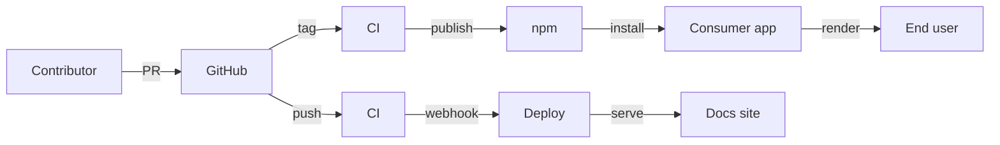

# Security Disclosure

The Vuetify team takes security seriously. We appreciate your efforts to responsibly disclose vulnerabilities and will make every effort to acknowledge your contributions.

<DocsPageFeatures :frontmatter />

## Reporting a Vulnerability

To report a security issue, email [security@vuetifyjs.com](mailto:security@vuetifyjs.com?subject=SECURITY) and include the word **"SECURITY"** in the subject line.

**Please include:**

- Description of the vulnerability
- Steps to reproduce
- Potential impact
- Any suggested fixes (optional)

## What to Expect

1. **Initial Response** — We will acknowledge receipt within 48 hours
2. **Investigation** — We will investigate and keep you informed of progress
3. **Resolution** — We will prepare and release fixes as quickly as possible
4. **Credit** — We will credit you in the release notes (unless you prefer anonymity)

## Disclosure Policy

When we receive a security report, we will:

- Confirm the problem and determine affected versions
- Audit code to find any similar issues
- Prepare fixes for all maintained releases
- Release fixes to npm as quickly as possible

Internally, security incidents are handled according to a formal Incident Response Plan that defines severity classification, response timelines, and escalation procedures.

## Threat Model

`@vuetify/v0` is a **client-side UI composables library**. It processes no secrets, manages no authentication, and communicates with no external services. This threat model uses the [STRIDE framework](https://en.wikipedia.org/wiki/STRIDE_(security)) to identify and mitigate threats across the project lifecycle.

### Assets

| Asset | Impact if Compromised |
|-------|----------------------|
| npm package (`@vuetify/v0`) | Supply chain attack on all downstream consumers |
| GitHub repository | Tampered source leads to tampered package |
| CI/CD secrets (npm token, deploy tokens) | Unauthorized publish or deployment |
| Documentation site | Defacement, phishing, malicious examples |
| Consumer app security | Apps trust v0 to not introduce XSS or injection |

### Trust Boundaries



### In Scope

| Category | Threats |
|----------|---------|
| Supply chain | Compromised npm publish credentials, malicious dependency updates, build pipeline injection, typosquatting, mutable CI action references |
| Consumer-facing | CSS injection via theme values, XSS through unsanitized slot/prop content, storage data exposure, CSP implications |
| CI/CD | Fork PR code execution, preview package abuse, deploy webhook replay, secret leakage |
| Contributor | Review bypass, social engineering via issues/PRs |
| Infrastructure | Docs site compromise via deploy pipeline, availability |

### Out of Scope

| Threat | Reason |
|--------|--------|
| XSS from user content | Consumer's responsibility to sanitize before passing to v0 |
| Authentication / authorization | v0 has no auth layer |
| Server-side code execution | v0 has no dynamic code execution; SSR rendering is stateless and read-only |
| Issues in consumer applications | v0 controls only what it exports |

### Supply Chain Hardening

These measures protect the integrity of `@vuetify/v0` from source to consumer:

- **Lockfile committed** — `pnpm-lock.yaml` is version-controlled, ensuring reproducible installs
- **Dependency cooldown** — pnpm `minimum-release-age` enforces a waiting period before newly published dependency versions can be installed, giving time for compromised packages to be detected
- **Pinned CI actions** — Vuetify-owned GitHub Actions are pinned to commit SHAs, not mutable branch refs, preventing silent changes via force-push
- **Scoped package** — published under the `@vuetify` npm org, reducing typosquatting risk
- **No lifecycle scripts** — no `postinstall` or `preinstall` scripts that could execute arbitrary code at install time

### Security Properties

These properties are verified in the codebase:

- **No network requests** — v0 makes no HTTP calls; the Knock notification adapter is opt-in only
- **No dynamic code evaluation** — no runtime code generation or arbitrary script execution
- **Prototype pollution protection** — `mergeDeep` blocks `__proto__`, `constructor`, and `prototype` keys
- **CSS injection protection** — Theme adapters validate theme names and color keys against a safe identifier pattern (`[a-zA-Z0-9_-]`), and reject color values containing dangerous CSS patterns. The browser adapter uses `adoptedStyleSheets` (no DOM parsing); SSR adapters use `innerHTML` on `<style>` tags only
- **SSR-safe globals** — all browser API access is guarded by `IN_BROWSER` checks
- **No cross-origin communication** — no `postMessage` or message event listeners

### Consumer Guidance

As a headless library, v0 delegates rendering to consumers. To maintain security in your application:

- **Sanitize user input** before passing it as slot content, props, or theme color values
- **Review CSP requirements** below if you use Content Security Policy headers
- **Use the adapter pattern** to control storage backends and notification services
- **Bound dataset sizes** when using `createVirtual`, `createFilter`, or `createDataTable` with user-controlled data

## Content Security Policy (CSP)

v0's theme system injects CSS custom properties at runtime. The CSP implications depend on which adapter you use:

| Adapter | Injection Method | CSP Requirement |
|---------|-----------------|-----------------|
| `V0StyleSheetThemeAdapter` (default) | `adoptedStyleSheets` API | None — programmatic stylesheets are CSP-exempt |
| `V0UnheadThemeAdapter` | `<style>` tag via Unhead | Requires `style-src 'nonce-<value>'` or `style-src 'unsafe-inline'` |

### Recommended: Nonce-based CSP with Unhead

If you use the Unhead adapter for SSR, configure a per-request nonce to avoid `unsafe-inline`:

```ts
// Server-side: generate a nonce per request
import crypto from 'node:crypto'
const nonce = crypto.randomBytes(16).toString('base64')

// Pass to Unhead
createHead({
  plugins: [
    // Your nonce plugin
  ]
})
```

```
Content-Security-Policy: style-src 'nonce-<value>';
```

### SPA-Only Apps

If you use the default `V0StyleSheetThemeAdapter`, no CSP changes are needed. The `adoptedStyleSheets` API is fully CSP-compatible.

## Third-Party Dependencies

Report security bugs in third-party modules to the maintainers of those modules. You can also report a vulnerability through [GitHub Security Advisories](https://github.com/vuetifyjs/0/security/advisories/new).

## Scope

This policy applies to the `@vuetify/v0` package and related packages in the [vuetifyjs/0](https://github.com/vuetifyjs/0) repository.

View the full [SECURITY.md](https://github.com/vuetifyjs/0/blob/master/SECURITY.md) on GitHub.
